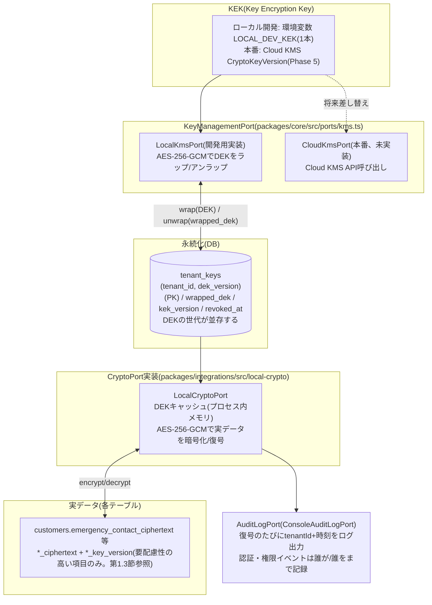
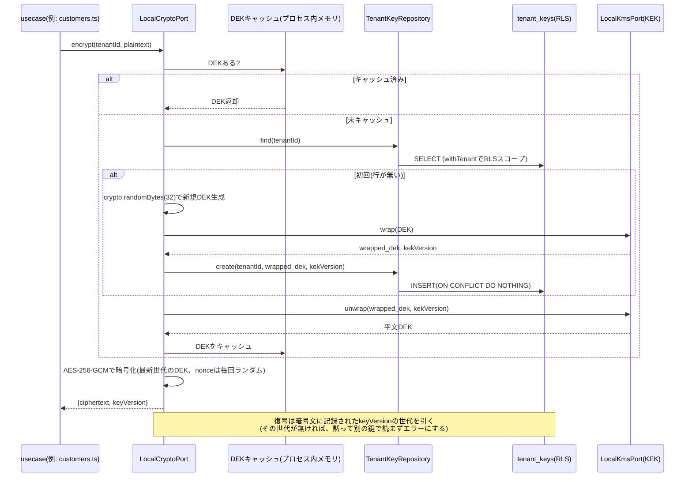

# 目的

katahimo-app(マルチテナントSaaS版)のPostgreSQLスキーマについて、有識者(セキュリティ・DB設計の観点)にレビューいただくための解説資料。実装は `packages/db/src/schema/*.ts`(Drizzle ORM)、マイグレーションは `packages/db/drizzle/*.sql` を正とする。本書はその要約・図解であり、フィールドの詳細な意味は各schemaファイルのコメントを一次情報として参照されたい。

対象読者は、実装の詳細(TypeScript/Drizzle)を読まなくても以下を判断できることを想定する。

- テナント分離の方式とその強制力(アプリのバグで他社データが漏れない設計になっているか)
- 個人情報(PII)の暗号化方式と鍵管理の妥当性
- スキーマ上の制約(PK/FK/UNIQUE)が実際にデータ整合性を守れているか

将来の拡張予定(予約・決済・カルテ・分析ダッシュボード)は `doc/07_技術構成提案書.md` 第4〜7章を参照。本書は現時点で実装済みのスキーマのみを対象とする。

---

# 1. 全体設計方針

## 1.1 マルチテナント分離: shared schema + `tenant_id` + Row Level Security(RLS)

全テーブル(`tenants`自身を除く)が `tenant_id` 列を持ち、PostgreSQLのRLSポリシー `tenant_isolation` を適用している。

```sql
USING      (tenant_id = current_setting('app.tenant_id', true)::uuid)
WITH CHECK (tenant_id = current_setting('app.tenant_id', true)::uuid)
```

アプリはリクエストごとに `withTenant(db, tenantId, fn)`(`packages/db/src/tenantScope.ts`)でトランザクションを張り、`SET LOCAL app.tenant_id` をセットしてからクエリを発行する。これにより、**アプリ側のWHERE句の書き忘れがあっても他テナントの行は見えない**(`current_setting`未設定時はNULLになり、`tenant_id = NULL` は常にfalseなので安全側に倒れる)。

## 1.2 複合主キー/複合外部キー(RLSだけでは防げない取り違えの防止)

RLSは`SELECT`/`UPDATE`/`DELETE`を絞り込むだけで、**PostgreSQLのFK制約(参照整合性チェック)はRLSを常にバイパスする**という仕様上の落とし穴がある。単一列FK(例: `daily_reports.customer_id → customers.id`)のままだと、アプリのバグでテナントAのセッション中にテナントBの`customer_id`を書き込んでも、DBはそれを検知できない。

これに対応するため、`customers`/`staff`に`UNIQUE(tenant_id, id)`を追加し、参照元テーブルのFKを`(tenant_id, xxx_id) → (tenant_id, id)`の複合FKにしている(下記ER図参照)。これにより「そのIDが本当にそのテナントの行か」をDBの制約自体が強制する。

## 1.3 PIIの暗号化(対象は要配慮性の高い項目に限定)

個人特定につながる項目のうち、要配慮性が特に高いもの(第三者情報・位置情報・自由記述・識別子)だけをフィールド暗号化の対象とする。

- **平文で保存(TDE+RLS+アクセス制御で保護)**: 氏名・かな・メール・電話・住所・駐車場情報。通常のSaaSと同水準の扱いとし、等値検索・将来の分析要件と両立させる。
- **AES-256-GCMによるランダム化暗号(`*_ciphertext` + `*_key_version`)で保存**: 緊急連絡先(第三者情報)・避難場所(通学先を特定しうる)・自由記述メモ(内容予測不可)・Benefit会員ID(識別子)・緯度経度(自宅の正確な位置情報)、および世帯構成員(児童本人の情報)・日報/事故報告本文・領収書明細・管理者設定のAPIキー等。

等値検索が必要な平文項目(氏名の姓)は、通常のインデックス(`customers_tenant_family_name_idx`)で検索する。ブラインドインデックス(HMAC)は、暗号化を維持する項目のうち等値検索が必要なもの(領収書の重複検出`dedupe_blind_index`)にのみ使う。

鍵はテナントごとに独立生成したDEK(データ暗号化鍵)を使い、DEK自体はKEK(Key Encryption Key)でラップした状態のみ`tenant_keys`テーブルに保存する(エンベロープ暗号化。詳細は第3章)。

## 1.4 トランザクション境界(UnitOfWork)

リポジトリ実装はメソッドごとに `withTenant()` で自前のトランザクションを開く。単独の書き込みならそれで足りるが、「ドメインの行を書く」と「`outbox_jobs` に積む」のように**揃って成立しなければ意味がない書き込み**では、片方だけが確定してしまう。

そのため `UnitOfWorkPort`(`packages/core/src/ports/unitOfWork.ts`、実装は `DrizzleUnitOfWork`(`packages/db/src/unitOfWork.ts`))でトランザクションを1つ開き、そこで得た `TransactionScope` をリポジトリメソッドの最後の引数(省略可能な `scope?: TransactionScope`)に渡す。スコープを渡されたリポジトリは新しいトランザクションを開かず、既存のものに相乗りする(`packages/db/src/tenantScope.ts` の `withTenant`)。渡されたスコープが別のDB接続・別テナントのものであれば例外で落とし、RLSが別テナントに束縛されたトランザクションへ黙って書くことを防ぐ。

この仕組みで同一トランザクションになっているのは次の2種類。

- 日報 / 事故報告 / 勤怠(出勤簿) / 領収書の保存 + `outbox_jobs` への enqueue(片方だけ確定すると、スプレッドシートへ永久に反映されないうえ、どのレコードが取り残されたのかを知る手段が無い)
- パスワード再設定コードの消費 + 新しいパスワードの書き込み(コードだけ焼かれてパスワードが変わらない状態を作らない)

## 1.5 RLSが全テーブルに張られていることの自動検証

テナント分離は「全テーブルに漏れなく張られている」ことが前提なので、テーブル追加時の書き忘れをテストで落とす。

- `packages/db/src/rlsPolicies.test.ts`: Drizzleスキーマの export から全テーブルを動的に集め、マイグレーションSQLに `ENABLE ROW LEVEL SECURITY` と `FORCE ROW LEVEL SECURITY` の両方があること、`tenant_isolation` ポリシーの `USING` / `WITH CHECK` が揃っていることを検査する。除外は `tenants` のみ。`FORCE` はdrizzle-kitが生成しないため手で追記しており、これが無いとテーブル所有者ロールでRLSが素通りする。新しいテーブルを足して書き忘れるとCIで落ちる。
- `packages/demo/src/rlsEnforcement.test.ts`: PGlite上に非特権ロールを作り、実際にクロステナントの読み書きが止まることを検証する。`FORCE` を付けたテーブルと付けないテーブルを並べて比較し、「FORCEの有無で挙動が変わる」ところまで固定している(テストが本当にFORCEを見ていることの裏付け)。

---

# 2. ER図(論理属性のみ抜粋)

`customers`は実装上41列あるため、ER図には代表的な列のみを示す。全列の一覧は第4章の表を参照。

```mermaid
erDiagram
    TENANTS ||--o{ TENANT_KEYS : "DEKの世代ごとに1行"
    TENANTS ||--|| APP_SETTINGS : "1テナント1設定"
    TENANTS ||--o{ STAFF : "所属"
    TENANTS ||--o{ CUSTOMERS : "所属"
    TENANTS ||--o{ OUTBOX_JOBS : "所属"

    CUSTOMERS ||--o{ FAMILY_MEMBERS : "世帯構成員"
    CUSTOMERS ||--o{ DAILY_REPORTS : "対象顧客"
    CUSTOMERS ||--o{ ACCIDENT_REPORTS : "対象顧客"
    CUSTOMERS |o--o{ RECEIPTS : "対象顧客(任意)"

    STAFF ||--o{ DAILY_REPORTS : "作成者"
    STAFF ||--o{ ACCIDENT_REPORTS : "作成者"
    STAFF ||--o{ RECEIPTS : "登録者"
    STAFF ||--o{ ATTENDANCE_DAYS : "本人"
    STAFF ||--o{ SESSIONS : "ログイン"
    STAFF ||--o{ PASSWORD_RESET_CODES : "パスワード再設定"

    TENANTS {
        uuid id PK
        string name
        string slug UK "ログイン時のテナント特定に使用"
        timestamp created_at
    }

    TENANT_KEYS {
        uuid tenant_id PK "FK -> tenants.id"
        int dek_version PK "DEKの世代。PKは(tenant_id, dek_version)の複合で、世代が並存する"
        text wrapped_dek "KEKでラップ済みDEK(平文DEKは保存しない)"
        int kek_version "KEKローテーション回数(DEKは変えずラップし直した回数)"
        timestamp revoked_at "非nullで暗号学的削除(解約)"
    }

    STAFF {
        uuid id PK
        uuid tenant_id FK "UK(tenant_id, id)としても機能"
        string name "平文"
        string email "平文。UK(tenant_id, email)、ログイン検索キー"
        string phone "平文"
        string password_hash "argon2id"
        string legacy_password_hash "GAS版移行用、移行後null"
        boolean is_admin
        date retirement_date
        boolean must_change_password "初期パスワードのまま。変更するまで他APIを403で拒否"
        int failed_login_attempts "連続ログイン失敗回数。成功で0に戻る"
        timestamp locked_until "この時刻まではログインを受け付けない(時間で自動的に解ける)"
    }

    CUSTOMERS {
        uuid id PK
        uuid tenant_id FK "UK(tenant_id, id)としても機能"
        string external_source "取込元(例: reserva)"
        string external_id "UK(tenant_id, external_source, external_id)"
        string name "平文"
        string family_name "平文。idx(tenant_id, family_name)で苗字検索"
        string given_name "平文"
        string email "平文"
        string phone "平文"
        string city "平文"
        string address_detail "平文"
        text emergency_contact_ciphertext "第三者情報のため暗号化"
        text evacuation_site_ciphertext "通学先特定リスクのため暗号化"
        text memo_ciphertext "自由記述のため暗号化"
        text lat_lng_ciphertext "自宅の正確な位置情報のため暗号化"
        string member_type "分類情報は平文"
        string payment_status "分類情報は平文"
        timestamp deactivated_at "ソフトデリート(物理削除しない)"
    }

    FAMILY_MEMBERS {
        uuid id PK
        uuid tenant_id FK
        uuid customer_id FK "複合FK(tenant_id, customer_id)"
        text name_ciphertext
        text dob_ciphertext
        text info_ciphertext "職業/アレルギー等の自由記述"
    }

    DAILY_REPORTS {
        uuid id PK
        uuid tenant_id FK
        uuid staff_id FK "複合FK(tenant_id, staff_id)"
        uuid customer_id FK "複合FK(tenant_id, customer_id)"
        timestamp occurred_at "平文(並び替えに使用)"
        int risk_rating "平文(集計用の小さな数値)"
        int es_rating "平文(集計用の小さな数値)"
        text content_ciphertext "本文JSONを1本にまとめて暗号化"
    }

    ACCIDENT_REPORTS {
        uuid id PK
        uuid tenant_id FK
        uuid staff_id FK "複合FK(tenant_id, staff_id)"
        uuid customer_id FK "複合FK(tenant_id, customer_id)"
        timestamp occurred_at
        string report_type "事故報告 | ヒヤリハット"
        text content_ciphertext
    }

    RECEIPTS {
        uuid id PK
        uuid tenant_id FK
        uuid staff_id FK "複合FK(tenant_id, staff_id)"
        uuid customer_id FK "複合FK・nullable(経費領収書は顧客に紐付かない)"
        timestamp receipt_timestamp
        string dedupe_blind_index "重複登録検出用HMAC"
        text amount_ciphertext
        text store_name_ciphertext
        string file_key "画像実体はStoragePort(GCS想定)"
    }

    ATTENDANCE_DAYS {
        uuid id PK
        uuid tenant_id FK
        uuid staff_id FK "複合FK(tenant_id, staff_id)"
        date business_date "UK(tenant_id, staff_id, business_date)"
        text row_data_ciphertext "入力列のみJSON化。派生値(残業時間等)は保存せず都度計算"
    }

    SESSIONS {
        uuid id PK
        uuid tenant_id FK
        uuid staff_id FK "複合FK(tenant_id, staff_id)"
        string token_hash UK "生トークンのSHA-256。生トークン自体はCookieのみ"
        timestamp expires_at
    }

    OUTBOX_JOBS {
        uuid id PK
        uuid tenant_id FK
        string kind "ミラー対象種別(attendance_day等)"
        uuid target_id
        string idempotency_key "UK(tenant_id, idempotency_key)。種別・レコードID・版(更新時刻)から組み立てる"
        string status "pending/processing/done/failed(failedは再試行上限に達したデッドレター)"
        int attempts "claimのたびに加算。上限8回"
        timestamp next_attempt_at "次に取り出してよい時刻。失敗のたびに指数バックオフで先送りする"
        timestamp updated_at "processingのまま落ちた行の回収判定に使う(5分で再claim可)"
    }

    PASSWORD_RESET_CODES {
        uuid id PK
        uuid tenant_id FK
        uuid staff_id FK "複合FK(tenant_id, staff_id)"
        string code_verifier "6桁コードのHMAC-SHA256。鍵(ペッパー)はDBに置かない"
        timestamp expires_at "発行から30分"
        timestamp consumed_at "使用済みのコードは再利用できない"
        int failed_attempts "誤入力5回で無効化"
    }

    APP_SETTINGS {
        uuid tenant_id PK "FK -> tenants.id"
        text gemini_api_key_ciphertext
        text gchat_report_webhook_url_ciphertext
        text gchat_receipt_webhook_url_ciphertext
    }
```



### ER図の読み方の補足

- 図中の複合FKは、mermaidのerDiagram記法が複合キーの関係線を1本しか表現できないため、実際の制約(`(tenant_id, xxx_id) → (tenant_id, id)`)は各エンティティの属性コメントに注記する形で表現している。実体は`packages/db/drizzle/*.sql`のDDLを参照。
- `RECEIPTS`と`CUSTOMERS`の関係のみ「任意(customer_idがnullable)」。経費のみの領収書(駐車場代等)を許容するための設計。

---

# 3. 暗号化アーキテクチャ(エンベロープ暗号化)

## 3.1 鍵の階層と依存関係



## 3.2 初回暗号化〜復号までの流れ(シーケンス)



## 3.3 設計上のポイント

- DEKはテナントごとに`crypto.randomBytes(32)`で独立に生成し、平文のままでは保存せず、常にKEKでラップした状態のみ`tenant_keys`に保存する。KEKが漏洩しても、攻撃者はテナントごとの`wrapped_dek`(DBの実体)も別途手に入れない限り実値を復号できない。
- **DEKは世代を並存させる**。主キーが`(tenant_id, dek_version)`の複合になっているため、`rotate()`は新しい世代を1行足すだけで済む。暗号化は常に最新世代、復号は暗号文に記録された世代(`*_key_version`)の鍵で行うので、ローテーションしても既存データが読めなくなることはない。1テナント1行だと、ローテーションした瞬間に旧世代の暗号文がすべて読めなくなる(=ローテーションが実質不可能になる)。
- テナント解約時は`tenant_keys`の該当行を`revoke()`するだけで、バックアップに残った暗号文も含めて復号不能にできる(暗号学的削除)。世代が複数あっても、revoke後はどの世代も復号できない。
- 本番のCloud KMSへの移行は、`KeyManagementPort`の実装(`LocalKmsPort`→Cloud KMS呼び出し)を差し替えるだけで済む設計にしてある(呼び出し側・DBのデータ形式は変えずに済む)。

## 3.4 現時点で未対応の項目(レビューで論点にしていただきたい点)

- **本番のKEK(Cloud KMS)は未実装**。KEKは環境変数(`LOCAL_DEV_KEK`)のままで、`CloudKmsPort`は差し替え口を用意してあるだけ。
- **既存データの再暗号化バッチは未実装**。DEKのローテーション自体は世代を足す形で行えるが(第3.3節)、古い世代で暗号化された値は古い世代の鍵のまま残る。読めなくはならない代わりに、**古い世代の鍵を捨てられない**。KEKのみのローテーション(rewrap)は`TenantKeyRepositoryPort.updateWrappedDek`で軽量に行える。
- **復号の監査ログ**は「どのテナントのデータをいつ復号したか」までで、「どのスタッフが」までは記録していない(`CryptoPort.decrypt(tenantId, value)`のシグネチャに呼び出し元情報が無く、全呼び出し箇所(usecases配下40箇所以上)への配線は影響範囲が大きいため)。認証・権限まわりのイベント(`AuditLogPort.record`)は呼び出し箇所が限られるため、`actorStaffId`(誰が)・`targetStaffId`(誰を)まで記録している。
- **平文列への参照は監査の網に入らない**。氏名・住所・電話は平文で保持しており(第1.3節)、その参照は復号を経由しないため`recordDecrypt`が呼ばれない。網羅的なデータアクセス監査が必要になった場合は、DB側の監査(pgaudit等)と組み合わせる前提。
- **ブラインドインデックスの使用範囲**: ブラインドインデックス(HMAC)を使うのは`receipts.dedupe_blind_index`(スタッフ・顧客・日時・金額・店舗名の組み合わせ)のみ。単一の低カーディナリティ属性(姓名等)ではなく複合キーであるため、辞書攻撃(想定される組み合わせの総当たり)の実現可能性は相対的に低いと考えられるが、鍵が漏洩すれば依然としてリスクは残る。

---

# 4. テーブル一覧と役割

| テーブル | 役割 | RLS | 備考 |
|---|---|---|---|
| `tenants` | テナント(法人)マスタ | 対象外(ログイン前のテナント特定に必要) | `slug`でテナントを特定後、RLSスコープ内で`staff`を検索する2段階方式 |
| `tenant_keys` | テナントごとのDEK(ラップ済み) | ○ | 主キーは`(tenant_id, dek_version)`。世代ごとに1行(第3章参照) |
| `staff` | スタッフ(認証情報を兼ねる) | ○ | `(tenant_id, id)`にUNIQUE。ログイン試行の絞り込み(`failed_login_attempts`/`locked_until`)もここ |
| `customers` | 顧客(利用世帯の代表者) | ○ | RESERVA CSVの全列に対応、41列。`(tenant_id, id)`にUNIQUE |
| `family_members` | 世帯構成員(子ども等) | ○ | `customers`の1:N |
| `daily_reports` | 保育日報 | ○ | `staff`・`customers`双方への複合FK |
| `accident_reports` | 事故報告/ヒヤリハット | ○ | 同上 |
| `receipts` | 領収書登録 | ○ | `customer_id`はnullable(経費のみの領収書を許容) |
| `attendance_days` | 勤怠(出勤簿)1日分 | ○ | 派生値(残業時間等)は保存せず都度計算 |
| `sessions` | ログインセッション | ○ | 生トークンはCookieのみ、DBにはSHA-256ハッシュだけ保存 |
| `password_reset_codes` | パスワード再設定の6桁コード | ○ | DBに保存するのはペッパー(環境変数、DBには置かない)を鍵にしたHMAC-SHA256の検証子。有効期限30分・誤入力5回で無効 |
| `outbox_jobs` | スプレッドシート等へのミラー書き込みジョブキュー | ○ | `(tenant_id, idempotency_key)`にUNIQUE。失敗は指数バックオフで再試行(`next_attempt_at`)し、上限8回に達した分だけ`failed`(デッドレター) |
| `app_settings` | テナント単位の管理者設定(APIキー等) | ○ | 1テナント1行、`tenant_id`がPK |

## 4.1 `customers` の全41列(暗号化方針別)

紙面の都合上ER図では代表列のみを示したため、全項目をカテゴリ別に列挙する。

| カテゴリ | 列 | 暗号化 |
|---|---|---|
| 識別子 | `id`, `tenant_id`, `external_source`, `external_id` | 平文(識別子そのもの) |
| 氏名 | `name`, `family_name`, `given_name`, `family_name_kana`, `given_name_kana` | 平文(TDE+RLSで保護)。`family_name`は`(tenant_id, family_name)`のインデックスで苗字検索に使う |
| 連絡先・住所 | `email`, `phone`, `address_detail`, `city`, `parking_area`, `parking_detail`, `address2` | 平文(TDE+RLSで保護) |
| 第三者情報・位置情報・自由記述 | `emergency_contact`, `emergency_contact_relation`, `evacuation_site`, `memo`, `lat_lng` | `*_ciphertext`+`*_key_version`(要配慮性が高いため暗号化) |
| 識別子(他システムの会員証番号) | `benefit_member_id` | `*_ciphertext`+`*_key_version` |
| 分類情報 | `member_type`, `member_status`, `payment_method`, `payment_status`, `gender`, `age_bracket` | 平文(個人特定に直結しない運用区分のため) |
| 日時 | `registered_at`, `external_last_updated_at`, `address2_start_date`, `address2_end_date`, `deactivated_at`, `created_at`, `updated_at` | 平文 |

---

# 5. レビュー観点(確認いただきたい点)

1. 複合PK/FK(第1.2節)によるテナント跨ぎ防止は、RLSと組み合わせた「二重の防御」として妥当か。他に見落としているPostgreSQLの仕様上の落とし穴はないか。
2. エンベロープ暗号化(第3章)の鍵階層(KEK→DEK→実データ)は、本番のCloud KMS移行を見据えた設計として妥当か。DEKの世代を並存させる方式(新しい書き込みだけ最新世代)を採っているが、既存データを新世代へ移す再暗号化の推奨手順(オンライン再暗号化 vs メンテナンス時間を確保したバッチ)に定石はあるか。
3. 復号の監査ログ(第3.4節)について、「誰が」まで記録する必要性・優先度をどう評価すべきか(認証・権限まわりのイベントは「誰が・誰を」まで記録している一方、平文列への参照は監査の網に入らない。医療系記録(将来の訪問看護展開、`doc/07`第7章)を扱う場合のコンプライアンス要件との関係)。
4. フィールド暗号化の対象を要配慮性の高い項目(緊急連絡先・避難場所・メモ・Benefit会員ID・緯度経度等、第1.3節)に限定している選定基準は妥当か。見直すべき点はあるか。
5. `daily_reports`/`attendance_days`のように自由記述をJSON1本にまとめて暗号化する設計は、将来の分析要件(日報からの傾向分析、勤怠ダッシュボード)とトレードオフになる。フィールド単位での暗号化に切り替える閾値(どの項目から平文分離すべきか)についての助言。
