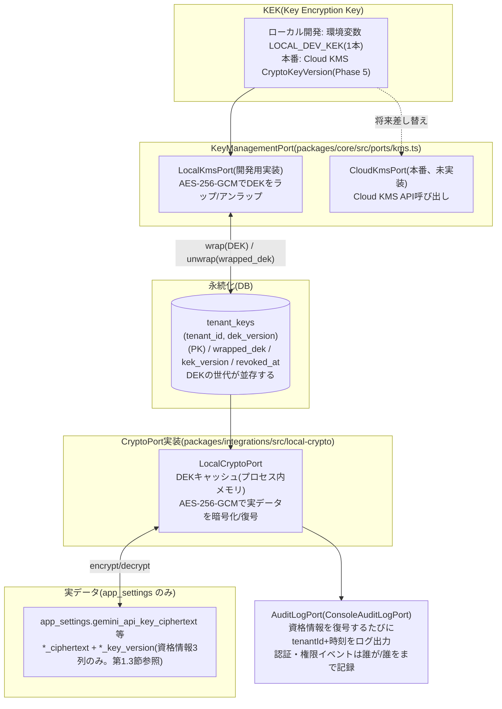
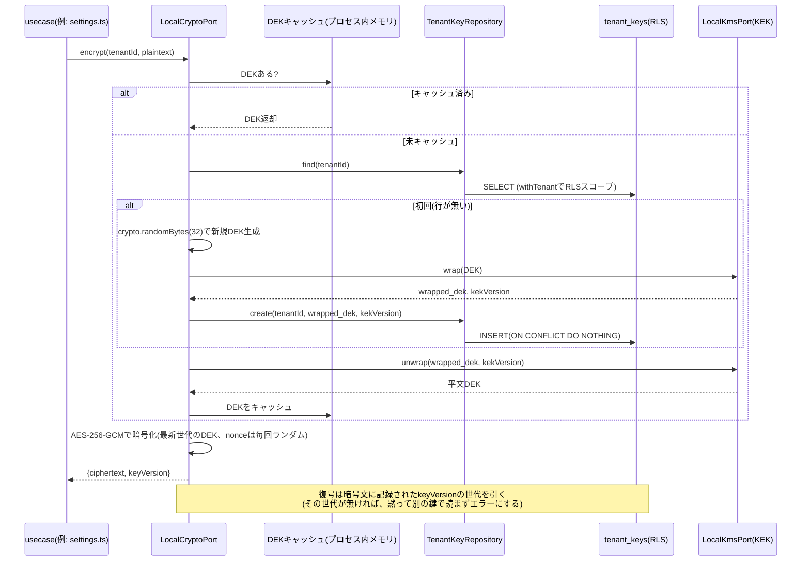

# 目的

katahimo-app(マルチテナントSaaS版)のPostgreSQLスキーマについて、有識者(セキュリティ・DB設計の観点)にレビューいただくための解説資料。実装は `packages/db/src/schema/*.ts`(Drizzle ORM)、マイグレーションは `packages/db/drizzle/*.sql` を正とする。本書はその要約・図解であり、フィールドの詳細な意味は各schemaファイルのコメントを一次情報として参照されたい。

対象読者は、実装の詳細(TypeScript/Drizzle)を読まなくても以下を判断できることを想定する。

- テナント分離の方式とその強制力(アプリのバグで他社データが漏れない設計になっているか)
- データ保護の方針(業務データは平文列+保存時暗号化+RLS、アプリ層で暗号化するのは資格情報のみ)と、資格情報用の鍵管理の妥当性
- スキーマ上の制約(PK/FK/UNIQUE)が実際にデータ整合性を守れているか

将来の拡張予定(予約・決済・カルテ・分析ダッシュボード)は `doc/07_技術構成提案書.md` 第4〜7章を参照。本書は現時点で実装済みのスキーマのみを対象とする。

---

# 1. 全体設計方針

## 1.1 マルチテナント分離: shared schema + `tenant_id` + Row Level Security(RLS)

全テーブル(`tenants`自身を除く)が `tenant_id` 列を持ち、PostgreSQLのRLSポリシー `tenant_isolation` を適用している。

```sql
USING      (tenant_id = current_setting('app.tenant_id', true)::uuid)
WITH CHECK (tenant_id = current_setting('app.tenant_id', true)::uuid)
```

アプリはリクエストごとに `withTenant(db, tenantId, fn)`(`packages/db/src/tenantScope.ts`)でトランザクションを張り、`SET LOCAL app.tenant_id` をセットしてからクエリを発行する。これにより、**アプリ側のWHERE句の書き忘れがあっても他テナントの行は見えない**(`current_setting`未設定時はNULLになり、`tenant_id = NULL` は常にfalseなので安全側に倒れる)。

## 1.2 複合主キー/複合外部キー(RLSだけでは防げない取り違えの防止)

RLSは`SELECT`/`UPDATE`/`DELETE`を絞り込むだけで、**PostgreSQLのFK制約(参照整合性チェック)はRLSを常にバイパスする**という仕様上の落とし穴がある。単一列FK(例: `daily_reports.customer_id → customers.id`)のままだと、アプリのバグでテナントAのセッション中にテナントBの`customer_id`を書き込んでも、DBはそれを検知できない。

これに対応するため、`customers`/`staff`に`UNIQUE(tenant_id, id)`を追加し、参照元テーブルのFKを`(tenant_id, xxx_id) → (tenant_id, id)`の複合FKにしている(下記ER図参照)。これにより「そのIDが本当にそのテナントの行か」をDBの制約自体が強制する。

## 1.3 データ保護(アプリ層のフィールド暗号化は資格情報のみ。2026-09 見直し)

アプリ層でフィールド暗号化するのは `app_settings` の資格情報3項目(Gemini APIキー・Google Chat Webhook URL 2本)だけとし、顧客・世帯構成員・日報・事故報告・勤怠・領収書の業務データは全て平文列で保存する。業務データの保護は、保存時の暗号化(本番配備時に Cloud SQL の既定機能で満たす想定。TDE 相当でバックアップも暗号化される。**未配備**)+ TLS + RLS(第1.1節)+ IAM/ロール分離 + argon2id で行う。

環境ごとの実態は次の3つに分かれる。ローカル開発(Docker の PostgreSQL、TDE なし)/ 公開デモ(ブラウザ内 PGlite、暗号鍵は公開されたデモ用固定値)/ 本番(Cloud Run + Cloud SQL、**未配備**)。現時点でコードとして担保しているのは RLS・ロール分離・argon2id・資格情報のアプリ層暗号化であり、Cloud SQL 側の保存時暗号化・TLS・IAM は本番配備時に満たすべき前提条件として扱う。

経緯: 当初は氏名・住所まで含む全面フィールド暗号化 → 2026-08 のレビューで「DB個別の暗号化は過剰、TDE+RLS+アクセス制御で十分」との指摘を受け、要配慮項目(緊急連絡先・避難場所・メモ・緯度経度・世帯構成員・日報/事故報告本文・領収書明細)に縮小 → 2026-09 に業務データを全て平文化。理由は次の3点。

- **検索性**: 日報・事故報告・勤怠・領収書を SQL で絞り込み・集計・全文検索できる。暗号文のままでは「ある顧客の日報から特定の語を探す」だけでも全件復号が要る。このため日報・事故報告の本文は JSON 1本ではなく項目ごとの `text` 列に分けた(第2章 ER図)。勤怠は常に1日分をまるごと読み書きする動的なオブジェクト(訪問・事務作業を配列で持つ。2026-09 `doc/14` B項でキーをスプレッドシートの列記号から意味のあるキーに変更。第2章 ER図参照)のため `jsonb` 1列のまま(分解する利点が無い)。
- **日報データの AI 活用**: 傾向分析・要約など日報を機械的に読む用途では、アプリ層暗号化は都度復号のコストと鍵の配線を分析側まで広げることになる。
- **契約が求める水準**: 実証協力事業者との秘密保持契約(案)第6条の安全管理措置は「アクセス制限、通信および保存時の暗号化、パスワード管理等」であり、フィールド単位の暗号化は要求していない。保存時の暗号化は本番配備時に Cloud SQL の既定機能で満たす想定(未配備)。第3条2・第4条(仙台市への報告は統計化・匿名化、スタッフ氏名は仮名化、住所は座標化)は分析・出力側の要件で、DB が平文であるほうが SQL で匿名化処理を実施しやすい。

資格情報だけ暗号化を残すのは、個人情報ではなく検索・AI 活用の対象外である一方、DB ダンプが流出した際に API キーや Webhook URL が平文で漏れるのを防ぐ価値があるため。

秘密保持契約(案)の条項との対応は次のとおり。

| NDA条項 | 要求 | katahimo-app での対応 | 状態 |
|---|---|---|---|
| 第6条 | アクセス制限 | Row Level Security(全テーブル `FORCE`。第1.1節・第1.5節)、`katahimo`(所有者/DDL)と `katahimo_app`(RLS 対象)のロール分離、管理者限定 API、セッション認証 | 実装済み(ローカル/デモで検証) |
| 第6条 | 通信時の暗号化 | HTTPS/TLS(Cloud Run。DB 接続も TLS) | 本番配備時(Cloud Run/Cloud SQL 接続設定) |
| 第6条 | 保存時の暗号化 | Cloud SQL の保存時暗号化(既定、バックアップ含む)+ 資格情報のみアプリ層 AES-256-GCM(エンベロープ暗号化。第3章) | Cloud SQL 側は本番配備時、資格情報のアプリ層暗号化は実装済み |
| 第6条 | パスワード管理 | argon2id、初期パスワードの強制変更(`must_change_password`)、ログイン試行の抑制(10回で15分ロック)、再設定コードは HMAC 検証子のみ保存 | 実装済み |
| 第7条 | 返還・廃棄 | テナント単位の物理 DELETE 手順 + バックアップ保持期間の満了(資格情報は `tenant_keys` の revoke でも復号不能にできる) | 手順・保持期間は本番配備時に定める(未整備) |
| 第3条2・第4条 | 匿名化 | 分析・AI 利用・報告書では氏名・連絡先・住所列を除外し統計化する(平文列なので SQL で実施可能。スタッフ氏名は仮名化、住所は座標化) | 分析・報告書作成時のルールとして未整備、平文列により実施可能になった |

等値検索が必要な項目は通常のインデックスで検索する(氏名の姓は `customers_tenant_family_name_idx`、領収書の重複検出は `receipts_tenant_dedupe_key_idx`)。ブラインドインデックス(HMAC)は廃止した。`receipts.dedupe_key` には `buildReceiptDedupeKey()`(`packages/core/src/domain/reports/receiptDedupe.ts`)の正規化済み文字列(スタッフ・顧客・日時・金額・店舗名)をそのまま保存し、等値一致で重複を検出する(GAS 版 `buildKey` と同じ挙動)。

既存の暗号化済みデータは引き継がない。マイグレーション `0005_drop_field_encryption` で暗号化列を削除し、`0006_plaintext_columns` で平文列を追加し、`0007_receipts_dedupe_key_unique` で `(tenant_id, dedupe_key)` の部分一意インデックスを張る(`NOT NULL` 列には `DEFAULT ''`/`'{}'` を付けてあるので行が残っている DB でも適用は通るが、既存行の本文は空になる)。

資格情報の鍵はテナントごとに独立生成した DEK(データ暗号化鍵)を使い、DEK 自体は KEK(Key Encryption Key)でラップした状態のみ `tenant_keys` テーブルに保存する(エンベロープ暗号化。詳細は第3章)。

## 1.4 トランザクション境界(UnitOfWork)

リポジトリ実装はメソッドごとに `withTenant()` で自前のトランザクションを開く。単独の書き込みならそれで足りるが、「ドメインの行を書く」と「`outbox_jobs` に積む」のように**揃って成立しなければ意味がない書き込み**では、片方だけが確定してしまう。

そのため `UnitOfWorkPort`(`packages/core/src/ports/unitOfWork.ts`、実装は `DrizzleUnitOfWork`(`packages/db/src/unitOfWork.ts`))でトランザクションを1つ開き、そこで得た `TransactionScope` をリポジトリメソッドの最後の引数(省略可能な `scope?: TransactionScope`)に渡す。スコープを渡されたリポジトリは新しいトランザクションを開かず、既存のものに相乗りする(`packages/db/src/tenantScope.ts` の `withTenant`)。渡されたスコープが別のDB接続・別テナントのものであれば例外で落とし、RLSが別テナントに束縛されたトランザクションへ黙って書くことを防ぐ。

この仕組みで同一トランザクションになっているのは次の2種類。

- 日報 / 事故報告 / 勤怠(出勤簿) / 領収書の保存 + `outbox_jobs` への enqueue(片方だけ確定すると、スプレッドシートへ永久に反映されないうえ、どのレコードが取り残されたのかを知る手段が無い)
- パスワード再設定コードの消費 + 新しいパスワードの書き込み(コードだけ焼かれてパスワードが変わらない状態を作らない)

## 1.5 RLSが全テーブルに張られていることの自動検証

テナント分離は「全テーブルに漏れなく張られている」ことが前提なので、テーブル追加時の書き忘れをテストで落とす。

- `packages/db/src/rlsPolicies.test.ts`: Drizzleスキーマの export から全テーブルを動的に集め、マイグレーションSQLに `ENABLE ROW LEVEL SECURITY` と `FORCE ROW LEVEL SECURITY` の両方があること、`tenant_isolation` ポリシーの `USING` / `WITH CHECK` が揃っていることを検査する。除外は `tenants` のみ。`FORCE` はdrizzle-kitが生成しないため手で追記しており、これが無いとテーブル所有者ロールでRLSが素通りする。新しいテーブルを足して書き忘れるとCIで落ちる。
- `packages/demo/src/rlsEnforcement.test.ts`: PGlite上に非特権ロールを作り、実際にクロステナントの読み書きが止まることを検証する。`FORCE` を付けたテーブルと付けないテーブルを並べて比較し、「FORCEの有無で挙動が変わる」ところまで固定している(テストが本当にFORCEを見ていることの裏付け)。

## 1.6 DBの CHECK 制約で値域を縛る方針(2026-09 `doc/14` D項)

Drizzleの `text({ enum: [...] })` は **TypeScript 上の型付けにすぎず、CHECK 制約としてDBには反映されない**(drizzle-kitが生成するマイグレーションSQLに`CHECK`文は出力されない)。実際、この指摘を受けるまで `packages/db/drizzle/*.sql` を全文検索してもCHECK制約が1件も存在しない状態で運用されており、`psql` から直接 `outbox_jobs.status='でたらめ'` のような値を書き込めた(書き込めばワーカーが永久に拾わない行になる)。`accident_reports.report_type` に至っては入口(API)・TypeScriptの型・DBの制約の3層すべてで値域を見ておらず、クライアントが任意の文字列を送ればそのまま保存されスプレッドシートにも書き出される状態だった。

これを受けて、値域が決まっている列にはマイグレーションで明示的にCHECK制約を追加した(`packages/db/drizzle/0009_add_check_constraints.sql`)。対象は `outbox_jobs.status`/`kind`/`attempts`、`accident_reports.report_type`、`daily_reports.risk_rating`/`es_rating`、`staff.failed_login_attempts`、`password_reset_codes.failed_attempts`、`tenant_keys.dek_version`/`kek_version`。後続の改修で追加した `receipts.amount_yen`/`billing_type`、`customers.lat`/`lng`、`coupons`/`coupon_redemptions` の割引種別と値の組み合わせにも同じ方針で制約を付けている(第2章・第4章参照)。あわせて入口(API)側の検証も、文字列かどうかではなく許可された値かどうかで判定するよう直した(DB制約は最後の砦であり、ここで弾かないとスプレッドシートへの書き出しまで進んでしまうため)。

`outbox_jobs.kind` の許可値はDDLに固定で書き写さず、`Record<MirrorKind, true>`(`packages/db/src/schema/outbox.ts`)から組み立てている。`MirrorKind`(`packages/core/src/ports/mirror.ts`)に追加・削除があればここが型エラーになるため、DB制約とアプリのポート型がズレたまま気付けない事態を防いでいる。

`packages/demo/src/checkConstraints.test.ts` が、本番と同じマイグレーションを当てたPGlite上で各制約の「正常値は通る」「不正値は拒否される」の両方を検証する。拒否側はエラーメッセージに制約名が含まれることまで確認しており、NOT NULLやFK等の別の理由でたまたま拒否されて「検証したつもりで何も検証していない」状態になることを防いでいる。

## 1.7 `updated_at` をDBトリガーで一元管理する方針(2026-09 `doc/14` E項)

更新日時はアプリのコードがUPDATEのたびにセットする方針だったが、実際には `customers` で書き忘れが起きていた(`customerRepository.ts` の `update()`/`deactivate()` はpatchの列だけをSETし、`updatedAt` を一度もセットしていなかった。`customers.updated_at` は行を作った時刻のまま永久に止まっていた)。ミラー書き込みジョブの冪等キーは `buildMirrorIdempotencyKey(kind, targetId, record.updatedAt)` のように更新時刻を材料にしているため、この書き忘れが他のテーブルで再発すると冪等キーが前回と同一になり `UNIQUE(tenant_id, idempotency_key)` に弾かれて編集内容がスプレッドシートへ永久に反映されなくなる。しかもエラーにならないため気付けない。

そこで「唯一の真実をDBに置く」方針に切り替え、`set_updated_at()` トリガー関数(`packages/db/drizzle/0010_updated_at_trigger.sql`)を `updated_at` 列を持つ全テーブルにBEFORE UPDATEトリガーとして張った。対象は `customers`/`staff`/`daily_reports`/`accident_reports`/`family_members`/`attendance_days`/`app_settings`/`tenant_keys`/`outbox_jobs`/`coupons`/`coupon_redemptions` の11テーブル(`receipts`/`sessions`/`password_reset_codes` は `created_at` のみで更新経路が無いため対象外)。アプリから `updatedAt` を明示指定しても、トリガーが常に `now()` で上書きする。

トリガーはDrizzleのスキーマ定義では表現できないため、マイグレーションSQLは手書きになる。**張り忘れが新しい書き忘れの種になる**ため、`packages/db/src/rlsPolicies.test.ts`(RLSの張り忘れ検出。第1.5節)と同じ方式の静的検査 `packages/db/src/updatedAtTriggers.test.ts` を追加した。Drizzleスキーマのexportから `updated_at` 列を持つテーブルを動的に集め、マイグレーションSQLの `CREATE`/`DROP TRIGGER` を出現順に畳み込んだ最終状態を見る(対象一覧をベタ書きすると、その一覧の更新し忘れ自体がトリガーの張り忘れと同じ壊れ方をテストがしてしまう)。`packages/demo/src/updatedAtTrigger.test.ts` はPGlite上で実際にUPDATE後 `updated_at` が進むこと、`customers` の編集で進むこと(この不具合の回帰テスト)、アプリから明示指定してもトリガーに上書きされることを確認する。

## 1.8 主要な検索経路にインデックスを張る方針(2026-09 `doc/14` C項)

PostgreSQLは**外部キーの参照する側に索引を自動作成しない**。`daily_reports`/`accident_reports`/`family_members` は主キーのみ、`receipts` は重複検出用の部分一意インデックスのみ、`sessions` はトークンハッシュの一意インデックスのみという状態で、`tenant_id`/`customer_id`/`staff_id` で絞り込む主要な読み取りがすべて全件走査になっていた。とくに「顧客の日報履歴」を開くたびに走る `listByCustomer`(`WHERE customer_id=? ORDER BY occurred_at DESC LIMIT n`)は最も頻度の高い読み取りで、日報は毎日積み上がる追記型のデータのため放置すれば必ず遅くなる。

`packages/db/drizzle/0008_add_missing_indexes.sql` で、`daily_reports`/`accident_reports`/`receipts` に `(tenant_id, customer_id, occurred_at DESC)`(`receipts` は `receipt_timestamp DESC`)、`family_members` に `(tenant_id, customer_id)`、`sessions` に `(tenant_id, staff_id)` の複合インデックスを追加した。`occurred_at`/`receipt_timestamp` をDESCで索引に含めるのは、`ORDER BY ... DESC LIMIT n` を並べ替えなしで返せるようにするため。リポジトリ層は実PostgreSQLに対する自動テストを持たないため、効果の検証は `EXPLAIN` で `Seq Scan` が `Index Scan` に変わることの手動確認にとどめている。

---

# 2. ER図(論理属性のみ抜粋)

`customers`は実装上37列あるため、ER図には代表的な列のみを示す。全列の一覧は第4章の表を参照。

```mermaid
erDiagram
    TENANTS ||--o{ TENANT_KEYS : "DEKの世代ごとに1行"
    TENANTS ||--|| APP_SETTINGS : "1テナント1設定"
    TENANTS ||--o{ STAFF : "所属"
    TENANTS ||--o{ CUSTOMERS : "所属"
    TENANTS ||--o{ OUTBOX_JOBS : "所属"
    TENANTS ||--o{ COUPONS : "テナントごとに管理"

    CUSTOMERS ||--o{ FAMILY_MEMBERS : "世帯構成員"
    CUSTOMERS ||--o{ DAILY_REPORTS : "対象顧客"
    CUSTOMERS ||--o{ ACCIDENT_REPORTS : "対象顧客"
    CUSTOMERS |o--o{ RECEIPTS : "対象顧客(任意)"

    STAFF ||--o{ DAILY_REPORTS : "作成者"
    STAFF ||--o{ ACCIDENT_REPORTS : "作成者"
    STAFF ||--o{ RECEIPTS : "登録者"
    STAFF ||--o{ ATTENDANCE_DAYS : "本人"
    STAFF ||--o{ SESSIONS : "ログイン"
    STAFF ||--o{ PASSWORD_RESET_CODES : "パスワード再設定"

    DAILY_REPORTS ||--o{ COUPON_REDEMPTIONS : "適用記録"
    COUPONS ||--o{ COUPON_REDEMPTIONS : "適用記録"

    TENANTS {
        uuid id PK
        string name
        string slug UK "ログイン時のテナント特定に使用"
        timestamp created_at
    }

    TENANT_KEYS {
        uuid tenant_id PK "FK -> tenants.id"
        int dek_version PK "DEKの世代。PKは(tenant_id, dek_version)の複合で、世代が並存する"
        text wrapped_dek "KEKでラップ済みDEK(平文DEKは保存しない)"
        int kek_version "KEKローテーション回数(DEKは変えずラップし直した回数)"
        timestamp revoked_at "非nullでrevoke済み(資格情報の暗号学的削除。業務データは平文なのでDELETEで消す)"
    }

    STAFF {
        uuid id PK
        uuid tenant_id FK "UK(tenant_id, id)としても機能"
        string name "平文"
        string email "平文。UK(tenant_id, email)、ログイン検索キー"
        string phone "平文"
        string password_hash "argon2id"
        string legacy_password_hash "GAS版移行用、移行後null"
        boolean is_admin
        date retirement_date
        boolean must_change_password "初期パスワードのまま。変更するまで他APIを403で拒否"
        int failed_login_attempts "連続ログイン失敗回数。成功で0に戻る"
        timestamp locked_until "この時刻まではログインを受け付けない(時間で自動的に解ける)"
    }

    CUSTOMERS {
        uuid id PK
        uuid tenant_id FK "UK(tenant_id, id)としても機能"
        string external_source "取込元(例: reserva)"
        string external_id "UK(tenant_id, external_source, external_id)"
        string name "平文"
        string family_name "平文。idx(tenant_id, family_name)で苗字検索"
        string given_name "平文"
        string email "平文"
        string phone "平文"
        string city "平文"
        string address_detail "平文"
        text emergency_contact "平文(2026-09まで暗号化列。第1.3節)"
        text emergency_contact_relation "平文"
        text evacuation_site "平文"
        text memo "平文(自由記述)"
        text benefit_member_id "平文"
        numeric lat "doc/14 G項。numeric(9,6)。CHECK customers_lat_range(-90〜90)"
        numeric lng "doc/14 G項。numeric(9,6)。CHECK customers_lng_range(-180〜180)"
        text lat_lng_raw "取込元の元表記。lat/lngの解析成否によらず常に保持"
        string member_type "分類情報は平文"
        string payment_status "分類情報は平文"
        timestamp deactivated_at "ソフトデリート(物理削除しない)"
    }

    FAMILY_MEMBERS {
        uuid id PK
        uuid tenant_id FK
        uuid customer_id FK "複合FK(tenant_id, customer_id)"
        text name "平文。NOT NULL DEFAULT ''"
        date dob_date "doc/14 F項。parseDateOnlyで解析できた場合のみ。不完全な表記は補わずnull"
        text dob_raw "元表記。解析成否によらず常に保持"
        text info "平文。職業/アレルギー等の自由記述"
    }

    DAILY_REPORTS {
        uuid id PK
        uuid tenant_id FK
        uuid staff_id FK "複合FK(tenant_id, staff_id)"
        uuid customer_id FK "複合FK(tenant_id, customer_id)"
        timestamp occurred_at "平文(並び替えに使用)。started_atと同じDateオブジェクトを共有(doc/14 F項、二重管理の食い違い防止)"
        int risk_rating "平文(集計用の小さな数値)。CHECK 1〜5"
        int es_rating "平文(集計用の小さな数値)。CHECK 1〜5"
        timestamp started_at "doc/14 F項。未入力はNULL"
        timestamp ended_at "doc/14 F項。日跨ぎ勤務はstarted_atより後(翌日)。CHECK daily_reports_time_order"
        text input_text "以下3列が本文。項目ごとの平文列(DailyReportContentと1:1)"
        text internal_text "社内向けレポート本文"
        text customer_text "保護者向けレポート本文"
    }

    ACCIDENT_REPORTS {
        uuid id PK
        uuid tenant_id FK
        uuid staff_id FK "複合FK(tenant_id, staff_id)"
        uuid customer_id FK "複合FK(tenant_id, customer_id)"
        timestamp occurred_at
        string report_type "事故報告 | ヒヤリハット"
        text target_name "以下12列が本文。項目ごとの平文列(AccidentReportContentと1:1)"
        date target_dob_date "doc/14 F項。parseDateOnlyで解析できた場合のみ"
        text target_dob_raw "元表記('yyyy/MM/dd')。常に保持"
        text occurrence_time
        text location
        text accident_content
        text situation
        text immediate_response
        text parent_correspondence
        text diagnosis_treatment
        text prevention
        text input_text "口語入力の元メモ"
    }

    RECEIPTS {
        uuid id PK
        uuid tenant_id FK
        uuid staff_id FK "複合FK(tenant_id, staff_id)"
        uuid customer_id FK "複合FK・nullable(経費領収書は顧客に紐付かない)"
        timestamp receipt_timestamp
        string dedupe_key "重複登録検出用。正規化済み文字列の等値一致。部分UNIQUE(tenant_id, dedupe_key) WHERE NOT NULL"
        int amount_yen "doc/14 A項。集計・請求用の整数。CHECK >=0。OCRが数値化できなければNULL"
        text amount_raw "OCRが返した生の文字列。人が後から直すときの参照用"
        text store_name "平文"
        text handoff_text "平文。申し送り"
        string file_key "画像実体はStoragePort(GCS想定)"
        string billing_type "customer_billable | company_expense。既定company_expense。CHECK制約(第4章)"
    }

    ATTENDANCE_DAYS {
        uuid id PK
        uuid tenant_id FK
        uuid staff_id FK "複合FK(tenant_id, staff_id)"
        date business_date "UK(tenant_id, staff_id, business_date)"
        jsonb row_data "平文。doc/14 B項でvisits/officeWork等の意味のあるキーに変更(旧: スプレッドシートの列記号キー)。CHECK jsonb_typeof='object'。派生値(残業時間等)は保存せず都度計算"
    }

    COUPONS {
        uuid id PK
        uuid tenant_id FK "UK(tenant_id, id)としても機能"
        string code "UK(tenant_id, code)"
        string name "表示名"
        string discount_kind "amount(金額引き) | percent(率引き)。CHECK制約"
        int discount_amount_yen "discount_kind=amountのとき必須。CHECK制約で組み合わせを縛る"
        int discount_percent "discount_kind=percentのとき必須(1〜100)"
        date valid_from "nullは下限なし"
        date valid_to "nullは無期限"
        boolean active "falseで廃止扱い。行は消さない(適用記録から参照されるため)"
    }

    COUPON_REDEMPTIONS {
        uuid id PK
        uuid tenant_id FK
        uuid daily_report_id FK "複合FK(tenant_id, daily_report_id)"
        uuid coupon_id FK "複合FK(tenant_id, coupon_id)。UK(tenant_id, daily_report_id, coupon_id)で二重適用を防止"
        timestamp applied_at
        string discount_kind "適用時点のスナップショット。couponsマスタの書き換えの影響を受けない"
        int discount_amount_yen "同上"
        int discount_percent "同上"
    }

    SESSIONS {
        uuid id PK
        uuid tenant_id FK
        uuid staff_id FK "複合FK(tenant_id, staff_id)"
        string token_hash UK "生トークンのSHA-256。生トークン自体はCookieのみ"
        timestamp expires_at
    }

    OUTBOX_JOBS {
        uuid id PK
        uuid tenant_id FK
        string kind "ミラー対象種別(attendance_day等)"
        uuid target_id
        string idempotency_key "UK(tenant_id, idempotency_key)。種別・レコードID・版(更新時刻)から組み立てる"
        string status "pending/processing/done/failed(failedは再試行上限に達したデッドレター)"
        int attempts "claimのたびに加算。上限8回"
        timestamp next_attempt_at "次に取り出してよい時刻。失敗のたびに指数バックオフで先送りする"
        timestamp updated_at "processingのまま落ちた行の回収判定に使う(5分で再claim可)"
    }

    PASSWORD_RESET_CODES {
        uuid id PK
        uuid tenant_id FK
        uuid staff_id FK "複合FK(tenant_id, staff_id)"
        string code_verifier "6桁コードのHMAC-SHA256。鍵(ペッパー)はDBに置かない"
        timestamp expires_at "発行から30分"
        timestamp consumed_at "使用済みのコードは再利用できない"
        int failed_attempts "誤入力5回で無効化"
    }

    APP_SETTINGS {
        uuid tenant_id PK "FK -> tenants.id"
        text gemini_api_key_ciphertext "AES-256-GCM。アプリ層で暗号化するのはこの3列のみ"
        text gchat_report_webhook_url_ciphertext "各列に対応する *_key_version(DEK世代)を持つ"
        text gchat_receipt_webhook_url_ciphertext
    }
```



### ER図の読み方の補足

- 図中の複合FKは、mermaidのerDiagram記法が複合キーの関係線を1本しか表現できないため、実際の制約(`(tenant_id, xxx_id) → (tenant_id, id)`)は各エンティティの属性コメントに注記する形で表現している。実体は`packages/db/drizzle/*.sql`のDDLを参照。
- `RECEIPTS`と`CUSTOMERS`の関係のみ「任意(customer_idがnullable)」。経費のみの領収書(駐車場代等)を許容するための設計。

---

# 3. 暗号化アーキテクチャ(エンベロープ暗号化)

本章の仕組みが適用されるのは `app_settings` の資格情報3列だけ(第1.3節)。業務データは平文列なので、この章の鍵階層・監査・revoke はいずれも業務データには及ばない。

## 3.1 鍵の階層と依存関係



## 3.2 初回暗号化〜復号までの流れ(シーケンス)



## 3.3 設計上のポイント

- DEKはテナントごとに`crypto.randomBytes(32)`で独立に生成し、平文のままでは保存せず、常にKEKでラップした状態のみ`tenant_keys`に保存する。KEKが漏洩しても、攻撃者はテナントごとの`wrapped_dek`(DBの実体)も別途手に入れない限り実値を復号できない。
- **DEKは世代を並存させる**。主キーが`(tenant_id, dek_version)`の複合になっているため、`rotate()`は新しい世代を1行足すだけで済む。暗号化は常に最新世代、復号は暗号文に記録された世代(`*_key_version`)の鍵で行うので、ローテーションしても既存データが読めなくなることはない。1テナント1行だと、ローテーションした瞬間に旧世代の暗号文がすべて読めなくなる(=ローテーションが実質不可能になる)。
- テナント解約時に`tenant_keys`の該当行を`revoke()`すると、バックアップに残った暗号文も含めて復号不能になる(暗号学的削除。世代が複数あっても、revoke後はどの世代も復号できない)。**ただし効くのは資格情報3列だけ**。顧客等の業務データは平文なので、解約・返還・廃棄(NDA 第7条)はテナント単位の物理 DELETE とバックアップ保持期間の満了で担保する(第1.3節の対応表)。
- 本番のCloud KMSへの移行は、`KeyManagementPort`の実装(`LocalKmsPort`→Cloud KMS呼び出し)を差し替えるだけで済む設計にしてある(呼び出し側・DBのデータ形式は変えずに済む)。

## 3.4 現時点で未対応の項目(レビューで論点にしていただきたい点)

- **本番のKEK(Cloud KMS)は未実装**。KEKは環境変数(`LOCAL_DEV_KEK`)のままで、`CloudKmsPort`は差し替え口を用意してあるだけ。
- **既存データの再暗号化バッチは未実装**。DEKのローテーション自体は世代を足す形で行えるが(第3.3節)、古い世代で暗号化された値は古い世代の鍵のまま残る。読めなくはならない代わりに、**古い世代の鍵を捨てられない**。KEKのみのローテーション(rewrap)は`TenantKeyRepositoryPort.updateWrappedDek`で軽量に行える。
- **復号の監査ログ**は「どのテナントのデータをいつ復号したか」までで、「どのスタッフが」までは記録していない(`CryptoPort.decrypt(tenantId, value)`のシグネチャに呼び出し元情報が無いため。復号の呼び出し箇所は資格情報を読む経路(管理者設定の読み出し・Gemini 呼び出し・Chat 通知)だけに減ったので、配線の影響範囲は以前より小さい)。認証・権限まわりのイベント(`AuditLogPort.record`)は呼び出し箇所が限られるため、`actorStaffId`(誰が)・`targetStaffId`(誰を)まで記録している。
- **業務データへの参照は監査の網に入らない**。顧客・世帯構成員・日報・事故報告・勤怠・領収書は全て平文列なので(第1.3節)、その参照は復号を経由せず`recordDecrypt`が呼ばれない。`recordDecrypt`が捕捉するのは資格情報の復号だけになった。データアクセス監査が必要になった場合は、DB側の監査(pgaudit等)が本命。
- **ブラインドインデックスは廃止済み(2026-09)**。以前は`receipts.dedupe_blind_index`(HMAC)を使っていたが、領収書明細を平文化したため正規化済み文字列の`dedupe_key`で等値一致させる形にし、HMAC 用の別鍵(`BlindIndexPort`)も無くした。

---

# 4. テーブル一覧と役割

| テーブル | 役割 | RLS | 備考 |
|---|---|---|---|
| `tenants` | テナント(法人)マスタ | 対象外(ログイン前のテナント特定に必要) | `slug`でテナントを特定後、RLSスコープ内で`staff`を検索する2段階方式 |
| `tenant_keys` | テナントごとのDEK(ラップ済み) | ○ | 主キーは`(tenant_id, dek_version)`。世代ごとに1行(第3章参照) |
| `staff` | スタッフ(認証情報を兼ねる) | ○ | `(tenant_id, id)`にUNIQUE。ログイン試行の絞り込み(`failed_login_attempts`/`locked_until`)もここ |
| `customers` | 顧客(利用世帯の代表者) | ○ | RESERVA CSVの全列に対応、37列。`(tenant_id, id)`にUNIQUE。緯度経度は`lat`/`lng`の数値2列(2026-09 `doc/14` G項) |
| `family_members` | 世帯構成員(子ども等) | ○ | `customers`の1:N。氏名・付帯情報は平文。生年月日は`dob_date`(日付型)+`dob_raw`(元表記)の2列(2026-09 `doc/14` F項) |
| `daily_reports` | 保育日報 | ○ | `staff`・`customers`双方への複合FK。本文は項目ごとの平文`text`列。開始・終了は`started_at`/`ended_at`(timestamptz)(2026-09 `doc/14` F項) |
| `accident_reports` | 事故報告/ヒヤリハット | ○ | 同上。本文は項目ごとの平文`text`列。対象児の生年月日は`target_dob_date`+`target_dob_raw`の2列(2026-09 `doc/14` F項) |
| `receipts` | 領収書登録 | ○ | `customer_id`はnullable(経費のみの領収書を許容)。重複検出は平文`dedupe_key`の等値一致。金額は`amount_yen`(整数)+`amount_raw`(生文字列)の2列、`billing_type`で顧客請求/会社経費を区別(2026-09 `doc/14` A項・第4章) |
| `attendance_days` | 勤怠(出勤簿)1日分 | ○ | 入力値は`row_data jsonb`(平文)。キーは`visits`/`officeWork`等の意味のあるキー(2026-09 `doc/14` B項。旧: スプレッドシートの列記号)。派生値(残業時間等)は保存せず都度計算 |
| `sessions` | ログインセッション | ○ | 生トークンはCookieのみ、DBにはSHA-256ハッシュだけ保存 |
| `password_reset_codes` | パスワード再設定の6桁コード | ○ | DBに保存するのはペッパー(環境変数、DBには置かない)を鍵にしたHMAC-SHA256の検証子。有効期限30分・誤入力5回で無効 |
| `outbox_jobs` | スプレッドシート等へのミラー書き込みジョブキュー | ○ | `(tenant_id, idempotency_key)`にUNIQUE。失敗は指数バックオフで再試行(`next_attempt_at`)し、上限8回に達した分だけ`failed`(デッドレター) |
| `app_settings` | テナント単位の管理者設定(APIキー等) | ○ | 1テナント1行、`tenant_id`がPK。資格情報3列がリポジトリ内で唯一のアプリ層暗号化列(第3章) |
| `coupons` | 割引クーポンの種別マスタ(金額引き/率引き) | ○ | `(tenant_id, code)`・`(tenant_id, id)`にUNIQUE。廃止は`active=false`(行は消さない。2026-09 `doc/14` 4.1章) |
| `coupon_redemptions` | 日報1件への割引クーポン適用記録 | ○ | `daily_reports`・`coupons`双方への複合FK。`(tenant_id, daily_report_id, coupon_id)`にUNIQUE(二重適用防止)。適用時点の割引条件をスナップショットして保持(2026-09 `doc/14` 4.1章) |

## 4.1 `customers` の全37列(全て平文)

紙面の都合上ER図では代表列のみを示したため、全項目をカテゴリ別に列挙する。2026-09 の見直し以降、暗号化列は無い(第1.3節)。

| カテゴリ | 列 | 備考 |
|---|---|---|
| 識別子 | `id`, `tenant_id`, `external_source`, `external_id` | 識別子そのもの |
| 氏名 | `name`, `family_name`, `given_name`, `family_name_kana`, `given_name_kana` | `family_name`は`(tenant_id, family_name)`のインデックスで苗字検索に使う |
| 連絡先・住所 | `email`, `phone`, `address_detail`, `city`, `parking_area`, `parking_detail`, `address2` | 保存時暗号化+RLSで保護。分析・報告時は除外/座標化の対象(NDA 第3条2・第4条) |
| 第三者情報・自由記述 | `emergency_contact`, `emergency_contact_relation`, `evacuation_site`, `memo` | 2026-09 まで`*_ciphertext`+`*_key_version`の暗号化列。検索性・AI 活用のため平文化(第1.3節) |
| 位置情報 | `lat`, `lng`, `lat_lng_raw` | 2026-09 まで`lat_lng`(暗号化列)1本の文字列だったが、計算(距離・ジオフェンス・座標化しての仙台市報告)に使うためnumeric(9,6)の数値2列+元表記に分割(2026-09 `doc/14` G項)。`lat`/`lng`にはCHECKで実在する座標の範囲(緯度-90〜90、経度-180〜180)を課す |
| 識別子(他システムの会員証番号) | `benefit_member_id` | 同上 |
| 分類情報 | `member_type`, `member_status`, `payment_method`, `payment_status`, `gender`, `age_bracket` | 個人特定に直結しない運用区分 |
| 日時 | `registered_at`, `external_last_updated_at`, `address2_start_date`, `address2_end_date`, `deactivated_at`, `created_at`, `updated_at` | |

---

# 5. レビュー観点(確認いただきたい点)

1. 複合PK/FK(第1.2節)によるテナント跨ぎ防止は、RLSと組み合わせた「二重の防御」として妥当か。他に見落としているPostgreSQLの仕様上の落とし穴はないか。
2. エンベロープ暗号化(第3章)の鍵階層(KEK→DEK→実データ)は、本番のCloud KMS移行を見据えた設計として妥当か。DEKの世代を並存させる方式(新しい書き込みだけ最新世代)を採っているが、既存データを新世代へ移す再暗号化の推奨手順(オンライン再暗号化 vs メンテナンス時間を確保したバッチ)に定石はあるか。
3. 復号の監査ログ(第3.4節)について、「誰が」まで記録する必要性・優先度をどう評価すべきか(認証・権限まわりのイベントは「誰が・誰を」まで記録している一方、平文列への参照は監査の網に入らない。医療系記録(将来の訪問看護展開、`doc/07`第7章)を扱う場合のコンプライアンス要件との関係)。
4. (2026-09 に見直し済み)フィールド暗号化の対象は資格情報3列のみに縮小し、業務データは平文+保存時暗号化+RLS とした(第1.3節)。新たな論点: 秘密保持契約(案)第3条2・第4条の匿名化ルール(氏名・連絡先・住所列の除外、スタッフ氏名の仮名化、住所の座標化)を分析・AI 利用時に SQL/ビューで実施する運用は妥当か。第7条(返還・廃棄)をテナント単位の物理 DELETE + バックアップ保持期間の満了で担保する整理に不足はないか。
5. (2026-09 に見直し済み)日報・事故報告の本文は項目ごとの平文`text`列に分離し、勤怠は`jsonb`1列とした(第1.3節・第2章)。新たな論点: 業務データが平文になったことで復号監査(第3.4節)が資格情報にしか効かなくなったため、DB 側監査(pgaudit 等)を入れるべき時期・粒度と、全文検索インデックス(`tsvector`/`pg_bigm` 等)を日報本文に付与する際の注意点。
6. 本番配備時のチェックリスト(TLS・保存時暗号化・バックアップ保持・削除手順)の妥当性(第1.3節。本番環境は未配備のため、配備前にこのチェックリストで確認する)。
