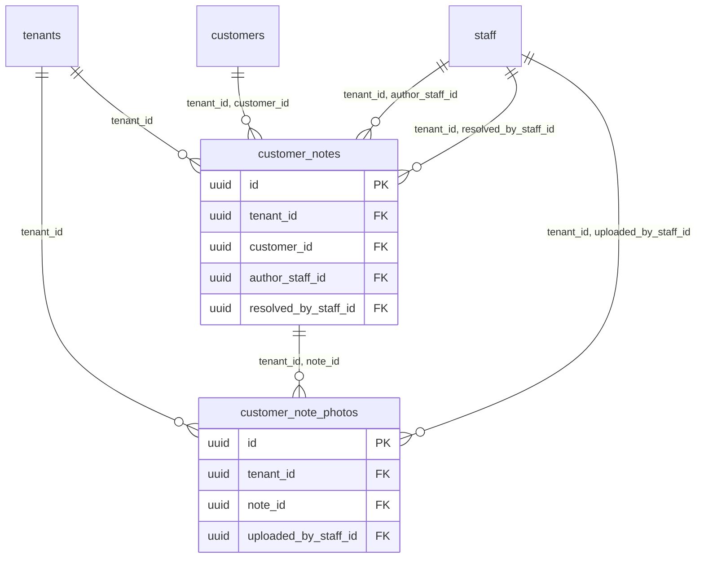
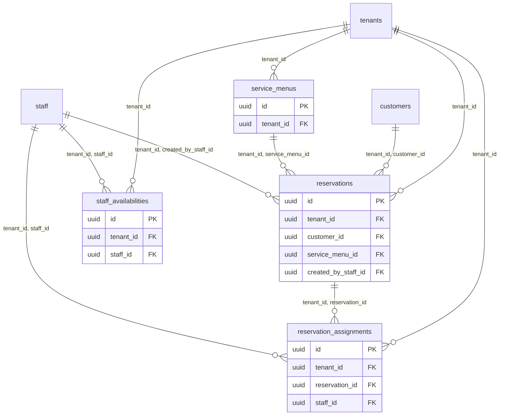
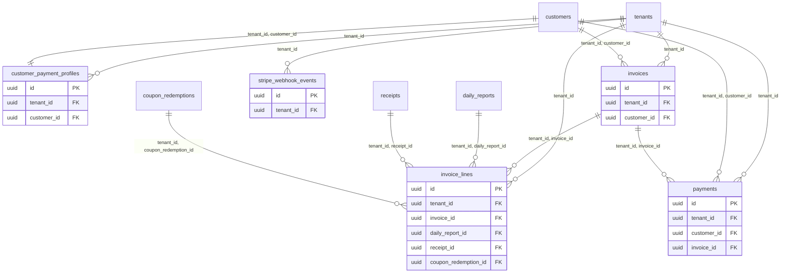

<!--
  このファイルは packages/db/src/schema/*.ts から自動生成される。手で編集しない。
  編集してもスキーマを変えた次の再生成で消える。内容を変えたいときはスキーマ定義か
  packages/db/src/docs/ の生成コードを直すこと。

  再生成: pnpm db:docs
-->

# データベース構造リファレンス

`packages/db/src/schema/*.ts` から機械的に書き出した、全テーブルの定義。
drizzleがDDLを起こすときと同じ解釈を通しているので、`packages/db/drizzle/*.sql` で
実際に適用される形と一致する。

ここに書くのはスキーマから導ける事実だけで、**なぜその形にしたのか**は扱わない。
設計の意図・テナント分離の方針・暗号化の構成は `doc/09_データベース構造解説.md`、
設計時に踏んだ落とし穴は `doc/14_データベース設計の指針と落とし穴.md` を参照。

## 規模

| 項目 | 数 |
|---|---|
| テーブル | 34 |
| 列 | 462 |
| 外部キー | 83 |
| インデックス | 54 |
| CHECK制約 | 111 |
| RLSポリシー | 33 |

---

# 1. ER図

1枚に収めると読めないため、業務ドメインごとに分ける(区切り方は `doc/09` 第2章と同じ)。
図に出すのは主キーと外部キーの列だけで、全列は第2章にある。
枠だけのテーブルは、そのドメインでは参照されるだけで定義は別の節にあることを示す。

## 1.1 既存の業務データ

GAS版から移行した範囲。認証・日報・勤怠・領収書・クーポンまで。

```mermaid
erDiagram
    tenants {
        uuid id "PK"
    }
    tenant_keys {
        uuid tenant_id "PK"
        integer dek_version "PK"
    }
    staff {
        uuid id "PK"
        uuid tenant_id "FK"
    }
    customers {
        uuid id "PK"
        uuid tenant_id "FK"
    }
    family_members {
        uuid id "PK"
        uuid tenant_id "FK"
        uuid customer_id "FK"
    }
    daily_reports {
        uuid id "PK"
        uuid tenant_id "FK"
        uuid staff_id "FK"
        uuid customer_id "FK"
        uuid reservation_id "FK"
    }
    accident_reports {
        uuid id "PK"
        uuid tenant_id "FK"
        uuid staff_id "FK"
        uuid customer_id "FK"
    }
    receipts {
        uuid id "PK"
        uuid tenant_id "FK"
        uuid staff_id "FK"
        uuid customer_id "FK"
        uuid cancelled_by_staff_id "FK"
    }
    attendance_days {
        uuid id "PK"
        uuid tenant_id "FK"
        uuid staff_id "FK"
    }
    sessions {
        uuid id "PK"
        uuid tenant_id "FK"
        uuid staff_id "FK"
    }
    password_reset_codes {
        uuid id "PK"
        uuid tenant_id "FK"
        uuid staff_id "FK"
    }
    outbox_jobs {
        uuid id "PK"
        uuid tenant_id "FK"
    }
    app_settings {
        uuid tenant_id "PK"
    }
    coupons {
        uuid id "PK"
        uuid tenant_id "FK"
    }
    customer_coupons {
        uuid id "PK"
        uuid tenant_id "FK"
        uuid customer_id "FK"
        uuid coupon_id "FK"
    }
    coupon_redemptions {
        uuid id "PK"
        uuid tenant_id "FK"
        uuid daily_report_id "FK"
        uuid customer_id "FK"
        uuid coupon_id "FK"
    }
    reservations {
    }
    tenants ||--o{ tenant_keys : "tenant_id"
    tenants ||--o{ staff : "tenant_id"
    tenants ||--o{ customers : "tenant_id"
    tenants ||--o{ family_members : "tenant_id"
    customers ||--o{ family_members : "tenant_id, customer_id"
    tenants ||--o{ daily_reports : "tenant_id"
    staff ||--o{ daily_reports : "tenant_id, staff_id"
    customers ||--o{ daily_reports : "tenant_id, customer_id"
    reservations ||--o{ daily_reports : "tenant_id, reservation_id"
    tenants ||--o{ accident_reports : "tenant_id"
    staff ||--o{ accident_reports : "tenant_id, staff_id"
    customers ||--o{ accident_reports : "tenant_id, customer_id"
    tenants ||--o{ receipts : "tenant_id"
    staff ||--o{ receipts : "tenant_id, staff_id"
    customers ||--o{ receipts : "tenant_id, customer_id"
    staff ||--o{ receipts : "tenant_id, cancelled_by_staff_id"
    tenants ||--o{ attendance_days : "tenant_id"
    staff ||--o{ attendance_days : "tenant_id, staff_id"
    tenants ||--o{ sessions : "tenant_id"
    staff ||--o{ sessions : "tenant_id, staff_id"
    tenants ||--o{ password_reset_codes : "tenant_id"
    staff ||--o{ password_reset_codes : "tenant_id, staff_id"
    tenants ||--o{ outbox_jobs : "tenant_id"
    tenants ||--o{ app_settings : "tenant_id"
    tenants ||--o{ coupons : "tenant_id"
    tenants ||--o{ customer_coupons : "tenant_id"
    customers ||--o{ customer_coupons : "tenant_id, customer_id"
    coupons ||--o{ customer_coupons : "tenant_id, coupon_id"
    tenants ||--o{ coupon_redemptions : "tenant_id"
    daily_reports ||--o{ coupon_redemptions : "tenant_id, daily_report_id, customer_id"
    coupons ||--o{ coupon_redemptions : "tenant_id, coupon_id"
```

## 1.2 顧客カルテ

顧客の家に関する運用情報(鍵の位置・ガレージ場所・注意点等)。

## 1.3 予約

## 1.4 請求・決済

## 1.5 訪問割当の最適化と移動手当

```mermaid
erDiagram
    trait_definitions {
        uuid id "PK"
        uuid tenant_id "FK"
    }
    customer_traits {
        uuid id "PK"
        uuid tenant_id "FK"
        uuid customer_id "FK"
        uuid definition_id "FK"
        text definition_subject_kind "FK"
        uuid recorded_by_staff_id "FK"
    }
    staff_traits {
        uuid id "PK"
        uuid tenant_id "FK"
        uuid staff_id "FK"
        uuid definition_id "FK"
        text definition_subject_kind "FK"
        uuid recorded_by_staff_id "FK"
    }
    staff_customer_compatibilities {
        uuid id "PK"
        uuid tenant_id "FK"
        uuid staff_id "FK"
        uuid customer_id "FK"
        uuid rated_by_staff_id "FK"
    }
    staff_customer_travel_estimates {
        uuid id "PK"
        uuid tenant_id "FK"
        uuid staff_id "FK"
        uuid customer_id "FK"
    }
    transport_allowance_rules {
        uuid id "PK"
        uuid tenant_id "FK"
    }
    travel_legs {
        uuid id "PK"
        uuid tenant_id "FK"
        uuid staff_id "FK"
        uuid to_customer_id "FK"
        uuid daily_report_id "FK"
        uuid allowance_rule_id "FK"
    }
    customers {
    }
    daily_reports {
    }
    staff {
    }
    tenants {
    }
    tenants ||--o{ trait_definitions : "tenant_id"
    tenants ||--o{ customer_traits : "tenant_id"
    customers ||--o{ customer_traits : "tenant_id, customer_id"
    trait_definitions ||--o{ customer_traits : "tenant_id, definition_subject_kind, definition_id"
    staff ||--o{ customer_traits : "tenant_id, recorded_by_staff_id"
    tenants ||--o{ staff_traits : "tenant_id"
    staff ||--o{ staff_traits : "tenant_id, staff_id"
    trait_definitions ||--o{ staff_traits : "tenant_id, definition_subject_kind, definition_id"
    staff ||--o{ staff_traits : "tenant_id, recorded_by_staff_id"
    tenants ||--o{ staff_customer_compatibilities : "tenant_id"
    staff ||--o{ staff_customer_compatibilities : "tenant_id, staff_id"
    customers ||--o{ staff_customer_compatibilities : "tenant_id, customer_id"
    staff ||--o{ staff_customer_compatibilities : "tenant_id, rated_by_staff_id"
    tenants ||--o{ staff_customer_travel_estimates : "tenant_id"
    staff ||--o{ staff_customer_travel_estimates : "tenant_id, staff_id"
    customers ||--o{ staff_customer_travel_estimates : "tenant_id, customer_id"
    tenants ||--o{ transport_allowance_rules : "tenant_id"
    tenants ||--o{ travel_legs : "tenant_id"
    staff ||--o{ travel_legs : "tenant_id, staff_id"
    customers ||--o{ travel_legs : "tenant_id, to_customer_id"
    daily_reports ||--o{ travel_legs : "tenant_id, daily_report_id"
    transport_allowance_rules ||--o{ travel_legs : "tenant_id, allowance_rule_id"
```

---

# 2. テーブル定義

並びは第1章の図と同じ。見出しは連番ではなくテーブル名にしてある(テーブルが増えても
以降の番号がずれず、差分が実際に変わった箇所だけになるため)。

## 2.1 既存の業務データ

### `tenants`

RLS: なし

| 列 | 型 | NULL | 既定値 |
|---|---|---|---|
| `id` (PK) | `uuid` | NOT NULL | `gen_random_uuid()` |
| `name` | `text` | NOT NULL | — |
| `slug` | `text` | NOT NULL | — |
| `created_at` | `timestamp with time zone` | NOT NULL | `now()` |

**インデックス**

- `tenants_slug_idx` `(slug)` UNIQUE

### `tenant_keys`

RLS: `tenant_isolation`(ALL)— `tenant_id = current_setting('app.tenant_id', true)::uuid`

| 列 | 型 | NULL | 既定値 |
|---|---|---|---|
| `tenant_id` (PK) | `uuid` | NOT NULL | — |
| `dek_version` (PK) | `integer` | NOT NULL | `1` |
| `wrapped_dek` | `text` | NOT NULL | — |
| `kek_version` | `integer` | NOT NULL | `1` |
| `created_at` | `timestamp with time zone` | NOT NULL | `now()` |
| `updated_at` | `timestamp with time zone` | NOT NULL | `now()` |
| `revoked_at` | `timestamp with time zone` | NULL可 | — |

**主キー(複合)**

- `(tenant_id, dek_version)`

**外部キー**

- `(tenant_id)` → `tenants(id)`

**CHECK制約**

- `tenant_keys_version_check` — `"tenant_keys"."dek_version" >= 1 AND "tenant_keys"."kek_version" >= 1`

### `staff`

RLS: `tenant_isolation`(ALL)— `tenant_id = current_setting('app.tenant_id', true)::uuid`

| 列 | 型 | NULL | 既定値 |
|---|---|---|---|
| `id` (PK) | `uuid` | NOT NULL | `gen_random_uuid()` |
| `tenant_id` | `uuid` | NOT NULL | — |
| `name` | `text` | NOT NULL | — |
| `email` | `text` | NOT NULL | — |
| `phone` | `text` | NULL可 | — |
| `password_hash` | `text` | NULL可 | — |
| `legacy_password_hash` | `text` | NULL可 | — |
| `is_admin` | `boolean` | NOT NULL | `false` |
| `retirement_date` | `date` | NULL可 | — |
| `must_change_password` | `boolean` | NOT NULL | `false` |
| `failed_login_attempts` | `integer` | NOT NULL | `0` |
| `locked_until` | `timestamp with time zone` | NULL可 | — |
| `home_address` | `text` | NULL可 | — |
| `home_lat` | `numeric(9, 6)` | NULL可 | — |
| `home_lng` | `numeric(9, 6)` | NULL可 | — |
| `preferred_transport_mode` | `text` | NULL可 | — |
| `created_at` | `timestamp with time zone` | NOT NULL | `now()` |
| `updated_at` | `timestamp with time zone` | NOT NULL | `now()` |

**一意制約**

- `staff_tenant_id_uk` `(tenant_id, id)`

**外部キー**

- `(tenant_id)` → `tenants(id)`

**CHECK制約**

- `staff_failed_login_attempts_check` — `"staff"."failed_login_attempts" >= 0`
- `staff_home_lat_range` — `"staff"."home_lat" IS NULL OR "staff"."home_lat" BETWEEN -90 AND 90`
- `staff_home_lng_range` — `"staff"."home_lng" IS NULL OR "staff"."home_lng" BETWEEN -180 AND 180`
- `staff_preferred_transport_mode_check` — `"staff"."preferred_transport_mode" IS NULL OR "staff"."preferred_transport_mode" IN ('car', 'public_transit', 'bicycle', 'walk')`

**インデックス**

- `staff_tenant_email_idx` `(tenant_id, email)` UNIQUE

### `customers`

RLS: `tenant_isolation`(ALL)— `tenant_id = current_setting('app.tenant_id', true)::uuid`

| 列 | 型 | NULL | 既定値 |
|---|---|---|---|
| `id` (PK) | `uuid` | NOT NULL | `gen_random_uuid()` |
| `tenant_id` | `uuid` | NOT NULL | — |
| `external_source` | `text` | NULL可 | — |
| `external_id` | `text` | NULL可 | — |
| `name` | `text` | NOT NULL | — |
| `family_name` | `text` | NOT NULL | — |
| `given_name` | `text` | NOT NULL | — |
| `family_name_kana` | `text` | NULL可 | — |
| `given_name_kana` | `text` | NULL可 | — |
| `email` | `text` | NULL可 | — |
| `phone` | `text` | NULL可 | — |
| `address_detail` | `text` | NULL可 | — |
| `city` | `text` | NULL可 | — |
| `parking_area` | `text` | NULL可 | — |
| `parking_detail` | `text` | NULL可 | — |
| `emergency_contact` | `text` | NULL可 | — |
| `emergency_contact_relation` | `text` | NULL可 | — |
| `evacuation_site` | `text` | NULL可 | — |
| `memo` | `text` | NULL可 | — |
| `benefit_member_id` | `text` | NULL可 | — |
| `address2` | `text` | NULL可 | — |
| `address2_start_date` | `date` | NULL可 | — |
| `address2_end_date` | `date` | NULL可 | — |
| `lat` | `numeric(9, 6)` | NULL可 | — |
| `lng` | `numeric(9, 6)` | NULL可 | — |
| `lat_lng_raw` | `text` | NULL可 | — |
| `member_type` | `text` | NULL可 | — |
| `member_status` | `text` | NULL可 | — |
| `payment_method` | `text` | NULL可 | — |
| `payment_status` | `text` | NULL可 | — |
| `gender` | `text` | NULL可 | — |
| `age_bracket` | `text` | NULL可 | — |
| `dob_date` | `date` | NULL可 | — |
| `dob_raw` | `text` | NULL可 | — |
| `registered_at` | `timestamp with time zone` | NULL可 | — |
| `external_last_updated_at` | `timestamp with time zone` | NULL可 | — |
| `deactivated_at` | `timestamp with time zone` | NULL可 | — |
| `created_at` | `timestamp with time zone` | NOT NULL | `now()` |
| `updated_at` | `timestamp with time zone` | NOT NULL | `now()` |

**一意制約**

- `customers_tenant_id_uk` `(tenant_id, id)`

**外部キー**

- `(tenant_id)` → `tenants(id)`

**CHECK制約**

- `customers_lat_range` — `"customers"."lat" IS NULL OR "customers"."lat" BETWEEN -90 AND 90`
- `customers_lng_range` — `"customers"."lng" IS NULL OR "customers"."lng" BETWEEN -180 AND 180`

**インデックス**

- `customers_tenant_external_idx` `(tenant_id, external_source, external_id)` UNIQUE
- `customers_tenant_family_name_idx` `(tenant_id, family_name)`

### `family_members`

RLS: `tenant_isolation`(ALL)— `tenant_id = current_setting('app.tenant_id', true)::uuid`

| 列 | 型 | NULL | 既定値 |
|---|---|---|---|
| `id` (PK) | `uuid` | NOT NULL | `gen_random_uuid()` |
| `tenant_id` | `uuid` | NOT NULL | — |
| `customer_id` | `uuid` | NOT NULL | — |
| `name` | `text` | NOT NULL | `''` |
| `dob_date` | `date` | NULL可 | — |
| `dob_raw` | `text` | NULL可 | — |
| `info` | `text` | NULL可 | — |
| `created_at` | `timestamp with time zone` | NOT NULL | `now()` |
| `updated_at` | `timestamp with time zone` | NOT NULL | `now()` |

**外部キー**

- `(tenant_id)` → `tenants(id)`
- `(tenant_id, customer_id)` → `customers(tenant_id, id)`

**インデックス**

- `family_members_tenant_customer_idx` `(tenant_id, customer_id)`

### `daily_reports`

RLS: `tenant_isolation`(ALL)— `tenant_id = current_setting('app.tenant_id', true)::uuid`

| 列 | 型 | NULL | 既定値 |
|---|---|---|---|
| `id` (PK) | `uuid` | NOT NULL | `gen_random_uuid()` |
| `tenant_id` | `uuid` | NOT NULL | — |
| `staff_id` | `uuid` | NOT NULL | — |
| `customer_id` | `uuid` | NOT NULL | — |
| `reservation_id` | `uuid` | NULL可 | — |
| `occurred_at` | `timestamp with time zone` | NOT NULL | — |
| `risk_rating` | `integer` | NULL可 | — |
| `es_rating` | `integer` | NULL可 | — |
| `started_at` | `timestamp with time zone` | NULL可 | — |
| `ended_at` | `timestamp with time zone` | NULL可 | — |
| `input_text` | `text` | NOT NULL | `''` |
| `internal_text` | `text` | NOT NULL | `''` |
| `customer_text` | `text` | NOT NULL | `''` |
| `created_at` | `timestamp with time zone` | NOT NULL | `now()` |
| `updated_at` | `timestamp with time zone` | NOT NULL | `now()` |

**一意制約**

- `daily_reports_tenant_id_uk` `(tenant_id, id)`
- `daily_reports_tenant_id_customer_uk` `(tenant_id, id, customer_id)`

**外部キー**

- `(tenant_id)` → `tenants(id)`
- `(tenant_id, staff_id)` → `staff(tenant_id, id)`
- `(tenant_id, customer_id)` → `customers(tenant_id, id)`
- `(tenant_id, reservation_id)` → `reservations(tenant_id, id)`

**CHECK制約**

- `daily_reports_risk_rating_check` — `"daily_reports"."risk_rating" IS NULL OR "daily_reports"."risk_rating" BETWEEN 1 AND 5`
- `daily_reports_es_rating_check` — `"daily_reports"."es_rating" IS NULL OR "daily_reports"."es_rating" BETWEEN 1 AND 5`
- `daily_reports_time_order` — `"daily_reports"."ended_at" IS NULL OR "daily_reports"."started_at" IS NULL OR "daily_reports"."ended_at" >= "daily_reports"."started_at"`

**インデックス**

- `daily_reports_tenant_reservation_uidx` `(tenant_id, reservation_id)` UNIQUE WHERE `"daily_reports"."reservation_id" IS NOT NULL`
- `daily_reports_tenant_customer_occurred_idx` `(tenant_id, customer_id, occurred_at)`

### `accident_reports`

RLS: `tenant_isolation`(ALL)— `tenant_id = current_setting('app.tenant_id', true)::uuid`

| 列 | 型 | NULL | 既定値 |
|---|---|---|---|
| `id` (PK) | `uuid` | NOT NULL | `gen_random_uuid()` |
| `tenant_id` | `uuid` | NOT NULL | — |
| `staff_id` | `uuid` | NOT NULL | — |
| `customer_id` | `uuid` | NOT NULL | — |
| `occurred_at` | `timestamp with time zone` | NOT NULL | — |
| `report_type` | `text` | NOT NULL | — |
| `target_name` | `text` | NOT NULL | `''` |
| `target_dob_date` | `date` | NULL可 | — |
| `target_dob_raw` | `text` | NOT NULL | `''` |
| `occurrence_time` | `text` | NOT NULL | `''` |
| `location` | `text` | NOT NULL | `''` |
| `accident_content` | `text` | NOT NULL | `''` |
| `situation` | `text` | NOT NULL | `''` |
| `immediate_response` | `text` | NOT NULL | `''` |
| `parent_correspondence` | `text` | NOT NULL | `''` |
| `diagnosis_treatment` | `text` | NOT NULL | `''` |
| `prevention` | `text` | NOT NULL | `''` |
| `input_text` | `text` | NOT NULL | `''` |
| `created_at` | `timestamp with time zone` | NOT NULL | `now()` |
| `updated_at` | `timestamp with time zone` | NOT NULL | `now()` |

**外部キー**

- `(tenant_id)` → `tenants(id)`
- `(tenant_id, staff_id)` → `staff(tenant_id, id)`
- `(tenant_id, customer_id)` → `customers(tenant_id, id)`

**CHECK制約**

- `accident_reports_report_type_check` — `"accident_reports"."report_type" IN ('事故報告', 'ヒヤリハット')`

**インデックス**

- `accident_reports_tenant_customer_occurred_idx` `(tenant_id, customer_id, occurred_at)`

### `receipts`

RLS: `tenant_isolation`(ALL)— `tenant_id = current_setting('app.tenant_id', true)::uuid`

| 列 | 型 | NULL | 既定値 |
|---|---|---|---|
| `id` (PK) | `uuid` | NOT NULL | `gen_random_uuid()` |
| `tenant_id` | `uuid` | NOT NULL | — |
| `staff_id` | `uuid` | NOT NULL | — |
| `customer_id` | `uuid` | NULL可 | — |
| `receipt_timestamp` | `timestamp with time zone` | NOT NULL | — |
| `dedupe_key` | `text` | NULL可 | — |
| `amount_yen` | `integer` | NULL可 | — |
| `amount_raw` | `text` | NULL可 | — |
| `store_name` | `text` | NULL可 | — |
| `handoff_text` | `text` | NULL可 | — |
| `file_key` | `text` | NOT NULL | — |
| `content_type` | `text` | NOT NULL | — |
| `billing_type` | `text` | NOT NULL | `'company_expense'` |
| `cancelled_at` | `timestamp with time zone` | NULL可 | — |
| `cancellation_reason` | `text` | NULL可 | — |
| `cancelled_by_staff_id` | `uuid` | NULL可 | — |
| `mirror_claimed_at` | `timestamp with time zone` | NULL可 | — |
| `cancellable_until` | `date` | NULL可 | — |
| `created_at` | `timestamp with time zone` | NOT NULL | `now()` |

**一意制約**

- `receipts_tenant_id_uk` `(tenant_id, id)`

**外部キー**

- `(tenant_id)` → `tenants(id)`
- `(tenant_id, staff_id)` → `staff(tenant_id, id)`
- `(tenant_id, customer_id)` → `customers(tenant_id, id)`
- `(tenant_id, cancelled_by_staff_id)` → `staff(tenant_id, id)`

**CHECK制約**

- `receipts_amount_yen_nonneg` — `"receipts"."amount_yen" IS NULL OR "receipts"."amount_yen" >= 0`
- `receipts_billing_type_check` — `"receipts"."billing_type" IN ('customer_billable', 'company_expense')`
- `receipts_billable_requires_customer` — `"receipts"."billing_type" = 'company_expense' OR "receipts"."customer_id" IS NOT NULL`
- `receipts_cancellation_pair_check` — `("receipts"."cancelled_at" IS NULL AND "receipts"."cancelled_by_staff_id" IS NULL AND "receipts"."cancellation_reason" IS NULL) OR ("receipts"."cancelled_at" IS NOT NULL AND "receipts"."cancelled_by_staff_id" IS NOT NULL)`

**インデックス**

- `receipts_tenant_dedupe_key_uidx` `(tenant_id, dedupe_key)` UNIQUE WHERE `"receipts"."dedupe_key" IS NOT NULL AND "receipts"."cancelled_at" IS NULL`
- `receipts_tenant_staff_timestamp_idx` `(tenant_id, staff_id, receipt_timestamp)`
- `receipts_tenant_customer_timestamp_idx` `(tenant_id, customer_id, receipt_timestamp)`

### `attendance_days`

RLS: `tenant_isolation`(ALL)— `tenant_id = current_setting('app.tenant_id', true)::uuid`

| 列 | 型 | NULL | 既定値 |
|---|---|---|---|
| `id` (PK) | `uuid` | NOT NULL | `gen_random_uuid()` |
| `tenant_id` | `uuid` | NOT NULL | — |
| `staff_id` | `uuid` | NOT NULL | — |
| `business_date` | `date` | NOT NULL | — |
| `row_data` | `jsonb` | NOT NULL | `[object Object]` |
| `created_at` | `timestamp with time zone` | NOT NULL | `now()` |
| `updated_at` | `timestamp with time zone` | NOT NULL | `now()` |

**外部キー**

- `(tenant_id)` → `tenants(id)`
- `(tenant_id, staff_id)` → `staff(tenant_id, id)`

**CHECK制約**

- `attendance_days_row_data_object` — `jsonb_typeof("attendance_days"."row_data") = 'object'`

**インデックス**

- `attendance_days_tenant_staff_date_idx` `(tenant_id, staff_id, business_date)` UNIQUE

### `sessions`

RLS: `tenant_isolation`(ALL)— `tenant_id = current_setting('app.tenant_id', true)::uuid`

| 列 | 型 | NULL | 既定値 |
|---|---|---|---|
| `id` (PK) | `uuid` | NOT NULL | `gen_random_uuid()` |
| `tenant_id` | `uuid` | NOT NULL | — |
| `staff_id` | `uuid` | NOT NULL | — |
| `token_hash` | `text` | NOT NULL | — |
| `expires_at` | `timestamp with time zone` | NOT NULL | — |
| `created_at` | `timestamp with time zone` | NOT NULL | `now()` |

**外部キー**

- `(tenant_id)` → `tenants(id)`
- `(tenant_id, staff_id)` → `staff(tenant_id, id)`

**インデックス**

- `sessions_token_hash_idx` `(token_hash)` UNIQUE
- `sessions_tenant_staff_idx` `(tenant_id, staff_id)`

### `password_reset_codes`

RLS: `tenant_isolation`(ALL)— `tenant_id = current_setting('app.tenant_id', true)::uuid`

| 列 | 型 | NULL | 既定値 |
|---|---|---|---|
| `id` (PK) | `uuid` | NOT NULL | `gen_random_uuid()` |
| `tenant_id` | `uuid` | NOT NULL | — |
| `staff_id` | `uuid` | NOT NULL | — |
| `code_verifier` | `text` | NOT NULL | — |
| `expires_at` | `timestamp with time zone` | NOT NULL | — |
| `consumed_at` | `timestamp with time zone` | NULL可 | — |
| `failed_attempts` | `integer` | NOT NULL | `0` |
| `created_at` | `timestamp with time zone` | NOT NULL | `now()` |

**外部キー**

- `(tenant_id)` → `tenants(id)`
- `(tenant_id, staff_id)` → `staff(tenant_id, id)`

**CHECK制約**

- `password_reset_codes_failed_attempts_check` — `"password_reset_codes"."failed_attempts" >= 0`

**インデックス**

- `password_reset_codes_staff_idx` `(tenant_id, staff_id, created_at)`

### `outbox_jobs`

RLS: `tenant_isolation`(ALL)— `tenant_id = current_setting('app.tenant_id', true)::uuid`

| 列 | 型 | NULL | 既定値 |
|---|---|---|---|
| `id` (PK) | `uuid` | NOT NULL | `gen_random_uuid()` |
| `tenant_id` | `uuid` | NOT NULL | — |
| `kind` | `text` | NOT NULL | — |
| `target_id` | `uuid` | NOT NULL | — |
| `idempotency_key` | `text` | NOT NULL | — |
| `status` | `text` | NOT NULL | `'pending'` |
| `attempts` | `integer` | NOT NULL | `0` |
| `last_error` | `text` | NULL可 | — |
| `next_attempt_at` | `timestamp with time zone` | NOT NULL | `now()` |
| `created_at` | `timestamp with time zone` | NOT NULL | `now()` |
| `updated_at` | `timestamp with time zone` | NOT NULL | `now()` |
| `processed_at` | `timestamp with time zone` | NULL可 | — |

**外部キー**

- `(tenant_id)` → `tenants(id)`

**CHECK制約**

- `outbox_jobs_status_check` — `"outbox_jobs"."status" IN ('pending', 'processing', 'done', 'failed')`
- `outbox_jobs_kind_check` — `"outbox_jobs"."kind" IN ('attendance_day', 'attendance_aggregate', 'daily_report', 'accident_report', 'receipt')`
- `outbox_jobs_attempts_check` — `"outbox_jobs"."attempts" >= 0`

**インデックス**

- `outbox_jobs_tenant_idempotency_key_idx` `(tenant_id, idempotency_key)` UNIQUE
- `outbox_jobs_tenant_status_next_attempt_idx` `(tenant_id, status, next_attempt_at, created_at)`
- `outbox_jobs_tenant_kind_target_idx` `(tenant_id, kind, target_id)`

### `app_settings`

RLS: `tenant_isolation`(ALL)— `tenant_id = current_setting('app.tenant_id', true)::uuid`

| 列 | 型 | NULL | 既定値 |
|---|---|---|---|
| `tenant_id` (PK) | `uuid` | NOT NULL | — |
| `gemini_api_key_ciphertext` | `text` | NULL可 | — |
| `gemini_api_key_key_version` | `integer` | NULL可 | — |
| `gemini_report_model` | `text` | NULL可 | — |
| `gemini_ocr_model` | `text` | NULL可 | — |
| `gchat_report_webhook_url_ciphertext` | `text` | NULL可 | — |
| `gchat_report_webhook_url_key_version` | `integer` | NULL可 | — |
| `gchat_receipt_webhook_url_ciphertext` | `text` | NULL可 | — |
| `gchat_receipt_webhook_url_key_version` | `integer` | NULL可 | — |
| `receipt_closing_day` | `integer` | NULL可 | — |
| `receipt_cancellable_days` | `integer` | NOT NULL | `2` |
| `updated_at` | `timestamp with time zone` | NOT NULL | `now()` |

**外部キー**

- `(tenant_id)` → `tenants(id)`

**CHECK制約**

- `app_settings_receipt_closing_day_check` — `"app_settings"."receipt_closing_day" IS NULL OR ("app_settings"."receipt_closing_day" >= 1 AND "app_settings"."receipt_closing_day" <= 28)`
- `app_settings_receipt_cancellable_days_check` — `"app_settings"."receipt_cancellable_days" >= 0 AND "app_settings"."receipt_cancellable_days" <= 14`

### `coupons`

RLS: `tenant_isolation`(ALL)— `tenant_id = current_setting('app.tenant_id', true)::uuid`

| 列 | 型 | NULL | 既定値 |
|---|---|---|---|
| `id` (PK) | `uuid` | NOT NULL | `gen_random_uuid()` |
| `tenant_id` | `uuid` | NOT NULL | — |
| `code` | `text` | NOT NULL | — |
| `name` | `text` | NOT NULL | — |
| `discount_kind` | `text` | NOT NULL | — |
| `discount_amount_yen` | `integer` | NULL可 | — |
| `discount_percent` | `integer` | NULL可 | — |
| `valid_from` | `date` | NULL可 | — |
| `valid_to` | `date` | NULL可 | — |
| `audience` | `text` | NOT NULL | `'all'` |
| `eligibility_kind` | `text` | NOT NULL | `'manual'` |
| `birthday_subject` | `text` | NULL可 | — |
| `usage_limit_kind` | `text` | NOT NULL | `'unlimited'` |
| `active` | `boolean` | NOT NULL | `true` |
| `note` | `text` | NULL可 | — |
| `created_at` | `timestamp with time zone` | NOT NULL | `now()` |
| `updated_at` | `timestamp with time zone` | NOT NULL | `now()` |

**一意制約**

- `coupons_tenant_code_uidx` `(tenant_id, code)`
- `coupons_tenant_id_uk` `(tenant_id, id)`

**外部キー**

- `(tenant_id)` → `tenants(id)`

**CHECK制約**

- `coupons_discount_kind_check` — `"coupons"."discount_kind" IN ('amount', 'percent')`
- `coupons_discount_value_check` — `("coupons"."discount_kind" = 'amount' AND "coupons"."discount_amount_yen" IS NOT NULL AND "coupons"."discount_percent" IS NULL) OR ("coupons"."discount_kind" = 'percent' AND "coupons"."discount_percent" IS NOT NULL AND "coupons"."discount_amount_yen" IS NULL)`
- `coupons_discount_amount_yen_check` — `"coupons"."discount_amount_yen" IS NULL OR "coupons"."discount_amount_yen" >= 0`
- `coupons_discount_percent_check` — `"coupons"."discount_percent" IS NULL OR "coupons"."discount_percent" BETWEEN 1 AND 100`
- `coupons_valid_period_check` — `"coupons"."valid_to" IS NULL OR "coupons"."valid_from" IS NULL OR "coupons"."valid_to" >= "coupons"."valid_from"`
- `coupons_audience_check` — `"coupons"."audience" IN ('all', 'assigned')`
- `coupons_eligibility_kind_check` — `"coupons"."eligibility_kind" IN ('manual', 'birthday_month')`
- `coupons_usage_limit_kind_check` — `"coupons"."usage_limit_kind" IN ('unlimited', 'once_per_customer', 'once_per_customer_per_year')`
- `coupons_birthday_subject_check` — `("coupons"."eligibility_kind" = 'birthday_month' AND "coupons"."birthday_subject" IS NOT NULL AND "coupons"."birthday_subject" IN ('customer', 'family_member', 'any')) OR ("coupons"."eligibility_kind" <> 'birthday_month' AND "coupons"."birthday_subject" IS NULL)`

### `customer_coupons`

RLS: `tenant_isolation`(ALL)— `tenant_id = current_setting('app.tenant_id', true)::uuid`

| 列 | 型 | NULL | 既定値 |
|---|---|---|---|
| `id` (PK) | `uuid` | NOT NULL | `gen_random_uuid()` |
| `tenant_id` | `uuid` | NOT NULL | — |
| `customer_id` | `uuid` | NOT NULL | — |
| `coupon_id` | `uuid` | NOT NULL | — |
| `valid_from` | `date` | NULL可 | — |
| `valid_to` | `date` | NULL可 | — |
| `note` | `text` | NULL可 | — |
| `created_at` | `timestamp with time zone` | NOT NULL | `now()` |
| `updated_at` | `timestamp with time zone` | NOT NULL | `now()` |

**一意制約**

- `customer_coupons_tenant_customer_coupon_uk` `(tenant_id, customer_id, coupon_id)`

**外部キー**

- `(tenant_id)` → `tenants(id)`
- `(tenant_id, customer_id)` → `customers(tenant_id, id)`
- `(tenant_id, coupon_id)` → `coupons(tenant_id, id)`

**CHECK制約**

- `customer_coupons_valid_period_check` — `"customer_coupons"."valid_to" IS NULL OR "customer_coupons"."valid_from" IS NULL OR "customer_coupons"."valid_to" >= "customer_coupons"."valid_from"`

### `coupon_redemptions`

RLS: `tenant_isolation`(ALL)— `tenant_id = current_setting('app.tenant_id', true)::uuid`

| 列 | 型 | NULL | 既定値 |
|---|---|---|---|
| `id` (PK) | `uuid` | NOT NULL | `gen_random_uuid()` |
| `tenant_id` | `uuid` | NOT NULL | — |
| `daily_report_id` | `uuid` | NOT NULL | — |
| `customer_id` | `uuid` | NOT NULL | — |
| `coupon_id` | `uuid` | NOT NULL | — |
| `applied_at` | `timestamp with time zone` | NOT NULL | `now()` |
| `discount_kind` | `text` | NOT NULL | — |
| `discount_amount_yen` | `integer` | NULL可 | — |
| `discount_percent` | `integer` | NULL可 | — |
| `usage_limit_kind` | `text` | NOT NULL | `'unlimited'` |
| `usage_scope_key` | `text` | NULL可 | — |
| `birthday_subject_name` | `text` | NULL可 | — |
| `birthday_subject_dob` | `date` | NULL可 | — |
| `note` | `text` | NULL可 | — |
| `created_at` | `timestamp with time zone` | NOT NULL | `now()` |
| `updated_at` | `timestamp with time zone` | NOT NULL | `now()` |

**一意制約**

- `coupon_redemptions_report_coupon_uidx` `(tenant_id, daily_report_id, coupon_id)`
- `coupon_redemptions_tenant_id_uk` `(tenant_id, id)`

**外部キー**

- `(tenant_id)` → `tenants(id)`
- `(tenant_id, daily_report_id, customer_id)` → `daily_reports(tenant_id, id, customer_id)`
- `(tenant_id, coupon_id)` → `coupons(tenant_id, id)`

**CHECK制約**

- `coupon_redemptions_discount_kind_check` — `"coupon_redemptions"."discount_kind" IN ('amount', 'percent')`
- `coupon_redemptions_discount_value_check` — `("coupon_redemptions"."discount_kind" = 'amount' AND "coupon_redemptions"."discount_amount_yen" IS NOT NULL AND "coupon_redemptions"."discount_percent" IS NULL) OR ("coupon_redemptions"."discount_kind" = 'percent' AND "coupon_redemptions"."discount_percent" IS NOT NULL AND "coupon_redemptions"."discount_amount_yen" IS NULL)`
- `coupon_redemptions_discount_amount_yen_check` — `"coupon_redemptions"."discount_amount_yen" IS NULL OR "coupon_redemptions"."discount_amount_yen" >= 0`
- `coupon_redemptions_discount_percent_check` — `"coupon_redemptions"."discount_percent" IS NULL OR "coupon_redemptions"."discount_percent" BETWEEN 1 AND 100`
- `coupon_redemptions_usage_limit_kind_check` — `"coupon_redemptions"."usage_limit_kind" IN ('unlimited', 'once_per_customer', 'once_per_customer_per_year')`
- `coupon_redemptions_usage_scope_key_check` — `("coupon_redemptions"."usage_limit_kind" = 'unlimited' AND "coupon_redemptions"."usage_scope_key" IS NULL) OR ("coupon_redemptions"."usage_limit_kind" <> 'unlimited' AND "coupon_redemptions"."usage_scope_key" IS NOT NULL)`

**インデックス**

- `coupon_redemptions_usage_scope_uidx` `(tenant_id, coupon_id, customer_id, usage_scope_key)` UNIQUE WHERE `"coupon_redemptions"."usage_scope_key" IS NOT NULL`
- `coupon_redemptions_tenant_coupon_idx` `(tenant_id, coupon_id)`
- `coupon_redemptions_tenant_customer_idx` `(tenant_id, customer_id)`

## 2.2 顧客カルテ

### `customer_notes`

RLS: `tenant_isolation`(ALL)— `tenant_id = current_setting('app.tenant_id', true)::uuid`

| 列 | 型 | NULL | 既定値 |
|---|---|---|---|
| `id` (PK) | `uuid` | NOT NULL | `gen_random_uuid()` |
| `tenant_id` | `uuid` | NOT NULL | — |
| `customer_id` | `uuid` | NOT NULL | — |
| `author_staff_id` | `uuid` | NOT NULL | — |
| `category` | `text` | NOT NULL | — |
| `title` | `text` | NOT NULL | `''` |
| `body` | `text` | NOT NULL | `''` |
| `pinned` | `boolean` | NOT NULL | `false` |
| `resolved_at` | `timestamp with time zone` | NULL可 | — |
| `resolved_by_staff_id` | `uuid` | NULL可 | — |
| `created_at` | `timestamp with time zone` | NOT NULL | `now()` |
| `updated_at` | `timestamp with time zone` | NOT NULL | `now()` |

**一意制約**

- `customer_notes_tenant_id_uk` `(tenant_id, id)`

**外部キー**

- `(tenant_id)` → `tenants(id)`
- `(tenant_id, customer_id)` → `customers(tenant_id, id)`
- `(tenant_id, author_staff_id)` → `staff(tenant_id, id)`
- `(tenant_id, resolved_by_staff_id)` → `staff(tenant_id, id)`

**CHECK制約**

- `customer_notes_category_check` — `"customer_notes"."category" IN ('chart', 'handover', 'key_location', 'garage', 'carry_over', 'caution', 'other')`
- `customer_notes_resolved_pair_check` — `("customer_notes"."resolved_at" IS NULL AND "customer_notes"."resolved_by_staff_id" IS NULL) OR ("customer_notes"."resolved_at" IS NOT NULL AND "customer_notes"."resolved_by_staff_id" IS NOT NULL)`

**インデックス**

- `customer_notes_tenant_customer_created_idx` `(tenant_id, customer_id, created_at)`
- `customer_notes_tenant_customer_category_idx` `(tenant_id, customer_id, category)`
- `customer_notes_tenant_open_idx` `(tenant_id, customer_id)` WHERE `"customer_notes"."resolved_at" IS NULL`

### `customer_note_photos`

RLS: `tenant_isolation`(ALL)— `tenant_id = current_setting('app.tenant_id', true)::uuid`

| 列 | 型 | NULL | 既定値 |
|---|---|---|---|
| `id` (PK) | `uuid` | NOT NULL | `gen_random_uuid()` |
| `tenant_id` | `uuid` | NOT NULL | — |
| `note_id` | `uuid` | NOT NULL | — |
| `uploaded_by_staff_id` | `uuid` | NOT NULL | — |
| `file_key` | `text` | NOT NULL | — |
| `content_type` | `text` | NOT NULL | — |
| `byte_size` | `integer` | NOT NULL | — |
| `caption` | `text` | NOT NULL | `''` |
| `sort_order` | `integer` | NOT NULL | `0` |
| `captured_at` | `timestamp with time zone` | NULL可 | — |
| `created_at` | `timestamp with time zone` | NOT NULL | `now()` |
| `updated_at` | `timestamp with time zone` | NOT NULL | `now()` |

**外部キー**

- `(tenant_id)` → `tenants(id)`
- `(tenant_id, note_id)` → `customer_notes(tenant_id, id)`
- `(tenant_id, uploaded_by_staff_id)` → `staff(tenant_id, id)`

**CHECK制約**

- `customer_note_photos_sort_order_check` — `"customer_note_photos"."sort_order" >= 0`
- `customer_note_photos_byte_size_check` — `"customer_note_photos"."byte_size" > 0 AND "customer_note_photos"."byte_size" <= 10485760`

**インデックス**

- `customer_note_photos_tenant_file_key_uidx` `(tenant_id, file_key)` UNIQUE
- `customer_note_photos_tenant_note_idx` `(tenant_id, note_id, sort_order)`

## 2.3 予約

### `service_menus`

RLS: `tenant_isolation`(ALL)— `tenant_id = current_setting('app.tenant_id', true)::uuid`

| 列 | 型 | NULL | 既定値 |
|---|---|---|---|
| `id` (PK) | `uuid` | NOT NULL | `gen_random_uuid()` |
| `tenant_id` | `uuid` | NOT NULL | — |
| `code` | `text` | NOT NULL | — |
| `name` | `text` | NOT NULL | — |
| `description` | `text` | NOT NULL | `''` |
| `duration_minutes` | `integer` | NOT NULL | — |
| `base_price_yen` | `integer` | NOT NULL | — |
| `active` | `boolean` | NOT NULL | `true` |
| `sort_order` | `integer` | NOT NULL | `0` |
| `external_source` | `text` | NULL可 | — |
| `external_id` | `text` | NULL可 | — |
| `created_at` | `timestamp with time zone` | NOT NULL | `now()` |
| `updated_at` | `timestamp with time zone` | NOT NULL | `now()` |

**一意制約**

- `service_menus_tenant_code_uk` `(tenant_id, code)`
- `service_menus_tenant_id_uk` `(tenant_id, id)`

**外部キー**

- `(tenant_id)` → `tenants(id)`

**CHECK制約**

- `service_menus_external_pair_check` — `("service_menus"."external_source" IS NULL) = ("service_menus"."external_id" IS NULL)`
- `service_menus_duration_minutes_check` — `"service_menus"."duration_minutes" > 0 AND "service_menus"."duration_minutes" <= 1440`
- `service_menus_base_price_yen_check` — `"service_menus"."base_price_yen" >= 0`
- `service_menus_sort_order_check` — `"service_menus"."sort_order" >= 0`

**インデックス**

- `service_menus_tenant_external_uidx` `(tenant_id, external_source, external_id)` UNIQUE WHERE `"service_menus"."external_id" IS NOT NULL`

### `reservations`

RLS: `tenant_isolation`(ALL)— `tenant_id = current_setting('app.tenant_id', true)::uuid`

| 列 | 型 | NULL | 既定値 |
|---|---|---|---|
| `id` (PK) | `uuid` | NOT NULL | `gen_random_uuid()` |
| `tenant_id` | `uuid` | NOT NULL | — |
| `customer_id` | `uuid` | NOT NULL | — |
| `service_menu_id` | `uuid` | NOT NULL | — |
| `status` | `text` | NOT NULL | `'requested'` |
| `source` | `text` | NOT NULL | — |
| `start_at` | `timestamp with time zone` | NOT NULL | — |
| `end_at` | `timestamp with time zone` | NOT NULL | — |
| `headcount` | `integer` | NOT NULL | `1` |
| `visit_address_override` | `text` | NULL可 | — |
| `request_note` | `text` | NOT NULL | `''` |
| `internal_note` | `text` | NOT NULL | `''` |
| `confirmed_at` | `timestamp with time zone` | NULL可 | — |
| `completed_at` | `timestamp with time zone` | NULL可 | — |
| `cancelled_at` | `timestamp with time zone` | NULL可 | — |
| `cancel_reason` | `text` | NULL可 | — |
| `external_source` | `text` | NULL可 | — |
| `external_id` | `text` | NULL可 | — |
| `created_by_staff_id` | `uuid` | NULL可 | — |
| `created_at` | `timestamp with time zone` | NOT NULL | `now()` |
| `updated_at` | `timestamp with time zone` | NOT NULL | `now()` |

**一意制約**

- `reservations_tenant_id_uk` `(tenant_id, id)`

**外部キー**

- `(tenant_id)` → `tenants(id)`
- `(tenant_id, customer_id)` → `customers(tenant_id, id)`
- `(tenant_id, service_menu_id)` → `service_menus(tenant_id, id)`
- `(tenant_id, created_by_staff_id)` → `staff(tenant_id, id)`

**CHECK制約**

- `reservations_external_pair_check` — `("reservations"."external_source" IS NULL) = ("reservations"."external_id" IS NULL)`
- `reservations_status_check` — `"reservations"."status" IN ('requested', 'confirmed', 'completed', 'cancelled', 'no_show')`
- `reservations_source_check` — `"reservations"."source" IN ('reserva', 'web', 'phone', 'admin')`
- `reservations_time_order_check` — `"reservations"."end_at" > "reservations"."start_at"`
- `reservations_headcount_check` — `"reservations"."headcount" >= 1`
- `reservations_cancelled_at_check` — `("reservations"."status" IN ('cancelled', 'no_show')) = ("reservations"."cancelled_at" IS NOT NULL)`
- `reservations_completed_at_check` — `("reservations"."status" = 'completed') = ("reservations"."completed_at" IS NOT NULL)`

**インデックス**

- `reservations_tenant_external_uidx` `(tenant_id, external_source, external_id)` UNIQUE WHERE `"reservations"."external_id" IS NOT NULL`
- `reservations_tenant_start_at_idx` `(tenant_id, start_at)`
- `reservations_tenant_customer_start_idx` `(tenant_id, customer_id, start_at)`
- `reservations_tenant_requested_idx` `(tenant_id, start_at)` WHERE `"reservations"."status" = 'requested'`

### `reservation_assignments`

RLS: `tenant_isolation`(ALL)— `tenant_id = current_setting('app.tenant_id', true)::uuid`

| 列 | 型 | NULL | 既定値 |
|---|---|---|---|
| `id` (PK) | `uuid` | NOT NULL | `gen_random_uuid()` |
| `tenant_id` | `uuid` | NOT NULL | — |
| `reservation_id` | `uuid` | NOT NULL | — |
| `staff_id` | `uuid` | NOT NULL | — |
| `role` | `text` | NOT NULL | `'primary'` |
| `assigned_at` | `timestamp with time zone` | NOT NULL | `now()` |
| `unassigned_at` | `timestamp with time zone` | NULL可 | — |
| `created_at` | `timestamp with time zone` | NOT NULL | `now()` |
| `updated_at` | `timestamp with time zone` | NOT NULL | `now()` |

**一意制約**

- `reservation_assignments_reservation_staff_uk` `(tenant_id, reservation_id, staff_id)`

**外部キー**

- `(tenant_id)` → `tenants(id)`
- `(tenant_id, reservation_id)` → `reservations(tenant_id, id)`
- `(tenant_id, staff_id)` → `staff(tenant_id, id)`

**CHECK制約**

- `reservation_assignments_role_check` — `"reservation_assignments"."role" IN ('primary', 'support')`
- `reservation_assignments_unassigned_order_check` — `"reservation_assignments"."unassigned_at" IS NULL OR "reservation_assignments"."unassigned_at" >= "reservation_assignments"."assigned_at"`

**インデックス**

- `reservation_assignments_primary_uidx` `(tenant_id, reservation_id)` UNIQUE WHERE `"reservation_assignments"."role" = 'primary' AND "reservation_assignments"."unassigned_at" IS NULL`
- `reservation_assignments_tenant_staff_idx` `(tenant_id, staff_id)`

### `staff_availabilities`

RLS: `tenant_isolation`(ALL)— `tenant_id = current_setting('app.tenant_id', true)::uuid`

| 列 | 型 | NULL | 既定値 |
|---|---|---|---|
| `id` (PK) | `uuid` | NOT NULL | `gen_random_uuid()` |
| `tenant_id` | `uuid` | NOT NULL | — |
| `staff_id` | `uuid` | NOT NULL | — |
| `kind` | `text` | NOT NULL | — |
| `weekday` | `integer` | NULL可 | — |
| `specific_date` | `date` | NULL可 | — |
| `start_time` | `time` | NOT NULL | — |
| `end_time` | `time` | NOT NULL | — |
| `note` | `text` | NOT NULL | `''` |
| `created_at` | `timestamp with time zone` | NOT NULL | `now()` |
| `updated_at` | `timestamp with time zone` | NOT NULL | `now()` |

**外部キー**

- `(tenant_id)` → `tenants(id)`
- `(tenant_id, staff_id)` → `staff(tenant_id, id)`

**CHECK制約**

- `staff_availabilities_kind_check` — `"staff_availabilities"."kind" IN ('available', 'unavailable')`
- `staff_availabilities_target_check` — `("staff_availabilities"."weekday" IS NULL) <> ("staff_availabilities"."specific_date" IS NULL)`
- `staff_availabilities_weekday_check` — `"staff_availabilities"."weekday" IS NULL OR "staff_availabilities"."weekday" BETWEEN 0 AND 6`
- `staff_availabilities_time_order_check` — `"staff_availabilities"."end_time" > "staff_availabilities"."start_time"`

**インデックス**

- `staff_availabilities_tenant_staff_idx` `(tenant_id, staff_id)`
- `staff_availabilities_tenant_date_idx` `(tenant_id, specific_date)` WHERE `"staff_availabilities"."specific_date" IS NOT NULL`

## 2.4 請求・決済

### `customer_payment_profiles`

RLS: `tenant_isolation`(ALL)— `tenant_id = current_setting('app.tenant_id', true)::uuid`

| 列 | 型 | NULL | 既定値 |
|---|---|---|---|
| `id` (PK) | `uuid` | NOT NULL | `gen_random_uuid()` |
| `tenant_id` | `uuid` | NOT NULL | — |
| `customer_id` | `uuid` | NOT NULL | — |
| `stripe_customer_id` | `text` | NOT NULL | — |
| `default_payment_method_id` | `text` | NULL可 | — |
| `default_payment_method_brand` | `text` | NULL可 | — |
| `default_payment_method_last4` | `text` | NULL可 | — |
| `created_at` | `timestamp with time zone` | NOT NULL | `now()` |
| `updated_at` | `timestamp with time zone` | NOT NULL | `now()` |

**一意制約**

- `customer_payment_profiles_tenant_customer_uk` `(tenant_id, customer_id)`
- `customer_payment_profiles_tenant_stripe_customer_uk` `(tenant_id, stripe_customer_id)`

**外部キー**

- `(tenant_id)` → `tenants(id)`
- `(tenant_id, customer_id)` → `customers(tenant_id, id)`

**CHECK制約**

- `customer_payment_profiles_last4_check` — `"customer_payment_profiles"."default_payment_method_last4" IS NULL OR "customer_payment_profiles"."default_payment_method_last4" ~ '^[0-9]{4}$'`

### `invoices`

RLS: `tenant_isolation`(ALL)— `tenant_id = current_setting('app.tenant_id', true)::uuid`

| 列 | 型 | NULL | 既定値 |
|---|---|---|---|
| `id` (PK) | `uuid` | NOT NULL | `gen_random_uuid()` |
| `tenant_id` | `uuid` | NOT NULL | — |
| `customer_id` | `uuid` | NOT NULL | — |
| `invoice_no` | `text` | NOT NULL | — |
| `status` | `text` | NOT NULL | `'draft'` |
| `billing_period_start` | `date` | NOT NULL | — |
| `billing_period_end` | `date` | NOT NULL | — |
| `subtotal_yen` | `integer` | NOT NULL | `0` |
| `discount_yen` | `integer` | NOT NULL | `0` |
| `tax_yen` | `integer` | NOT NULL | `0` |
| `total_yen` | `integer` | NOT NULL | `0` |
| `due_date` | `date` | NULL可 | — |
| `issued_at` | `timestamp with time zone` | NULL可 | — |
| `paid_at` | `timestamp with time zone` | NULL可 | — |
| `voided_at` | `timestamp with time zone` | NULL可 | — |
| `stripe_invoice_id` | `text` | NULL可 | — |
| `note` | `text` | NOT NULL | `''` |
| `created_at` | `timestamp with time zone` | NOT NULL | `now()` |
| `updated_at` | `timestamp with time zone` | NOT NULL | `now()` |

**一意制約**

- `invoices_tenant_invoice_no_uk` `(tenant_id, invoice_no)`
- `invoices_tenant_id_uk` `(tenant_id, id)`

**外部キー**

- `(tenant_id)` → `tenants(id)`
- `(tenant_id, customer_id)` → `customers(tenant_id, id)`

**CHECK制約**

- `invoices_status_check` — `"invoices"."status" IN ('draft', 'open', 'paid', 'void', 'uncollectible')`
- `invoices_period_order_check` — `"invoices"."billing_period_end" >= "invoices"."billing_period_start"`
- `invoices_amount_nonneg_check` — `"invoices"."subtotal_yen" >= 0 AND "invoices"."discount_yen" >= 0 AND "invoices"."tax_yen" >= 0 AND "invoices"."total_yen" >= 0`
- `invoices_total_consistency_check` — `"invoices"."total_yen" = "invoices"."subtotal_yen" - "invoices"."discount_yen" + "invoices"."tax_yen"`
- `invoices_issued_at_check` — `("invoices"."status" = 'draft') = ("invoices"."issued_at" IS NULL)`
- `invoices_paid_at_check` — `("invoices"."status" = 'paid') = ("invoices"."paid_at" IS NOT NULL)`
- `invoices_voided_at_check` — `("invoices"."status" = 'void') = ("invoices"."voided_at" IS NOT NULL)`

**インデックス**

- `invoices_tenant_stripe_invoice_uidx` `(tenant_id, stripe_invoice_id)` UNIQUE WHERE `"invoices"."stripe_invoice_id" IS NOT NULL`
- `invoices_tenant_customer_period_idx` `(tenant_id, customer_id, billing_period_start)`
- `invoices_tenant_open_idx` `(tenant_id, due_date)` WHERE `"invoices"."status" = 'open'`

### `invoice_lines`

RLS: `tenant_isolation`(ALL)— `tenant_id = current_setting('app.tenant_id', true)::uuid`

| 列 | 型 | NULL | 既定値 |
|---|---|---|---|
| `id` (PK) | `uuid` | NOT NULL | `gen_random_uuid()` |
| `tenant_id` | `uuid` | NOT NULL | — |
| `invoice_id` | `uuid` | NOT NULL | — |
| `line_no` | `integer` | NOT NULL | — |
| `kind` | `text` | NOT NULL | — |
| `description` | `text` | NOT NULL | — |
| `quantity` | `numeric(10, 2)` | NOT NULL | `'1'` |
| `unit_price_yen` | `integer` | NULL可 | — |
| `amount_yen` | `integer` | NOT NULL | — |
| `daily_report_id` | `uuid` | NULL可 | — |
| `receipt_id` | `uuid` | NULL可 | — |
| `coupon_redemption_id` | `uuid` | NULL可 | — |
| `superseded_at` | `timestamp with time zone` | NULL可 | — |
| `created_at` | `timestamp with time zone` | NOT NULL | `now()` |
| `updated_at` | `timestamp with time zone` | NOT NULL | `now()` |

**一意制約**

- `invoice_lines_invoice_line_no_uk` `(tenant_id, invoice_id, line_no)`

**外部キー**

- `(tenant_id)` → `tenants(id)`
- `(tenant_id, invoice_id)` → `invoices(tenant_id, id)`
- `(tenant_id, daily_report_id)` → `daily_reports(tenant_id, id)`
- `(tenant_id, receipt_id)` → `receipts(tenant_id, id)`
- `(tenant_id, coupon_redemption_id)` → `coupon_redemptions(tenant_id, id)`

**CHECK制約**

- `invoice_lines_kind_check` — `"invoice_lines"."kind" IN ('service', 'receipt_billable', 'transport_allowance', 'coupon_discount', 'adjustment')`
- `invoice_lines_line_no_check` — `"invoice_lines"."line_no" >= 1`
- `invoice_lines_quantity_check` — `"invoice_lines"."quantity" > 0`
- `invoice_lines_unit_price_check` — `"invoice_lines"."unit_price_yen" IS NULL OR "invoice_lines"."unit_price_yen" >= 0`
- `invoice_lines_amount_sign_check` — `("invoice_lines"."kind" = 'coupon_discount' AND "invoice_lines"."amount_yen" <= 0) OR ("invoice_lines"."kind" = 'adjustment') OR ("invoice_lines"."kind" NOT IN ('coupon_discount', 'adjustment') AND "invoice_lines"."amount_yen" >= 0)`
- `invoice_lines_source_check` — `("invoice_lines"."kind" = 'receipt_billable' AND "invoice_lines"."receipt_id" IS NOT NULL) OR ("invoice_lines"."kind" = 'coupon_discount' AND "invoice_lines"."coupon_redemption_id" IS NOT NULL) OR "invoice_lines"."kind" NOT IN ('receipt_billable', 'coupon_discount')`

**インデックス**

- `invoice_lines_tenant_receipt_uidx` `(tenant_id, receipt_id)` UNIQUE WHERE `"invoice_lines"."receipt_id" IS NOT NULL AND "invoice_lines"."superseded_at" IS NULL`
- `invoice_lines_tenant_coupon_redemption_uidx` `(tenant_id, coupon_redemption_id)` UNIQUE WHERE `"invoice_lines"."coupon_redemption_id" IS NOT NULL AND "invoice_lines"."superseded_at" IS NULL`
- `invoice_lines_tenant_invoice_idx` `(tenant_id, invoice_id, line_no)`
- `invoice_lines_tenant_daily_report_idx` `(tenant_id, daily_report_id)` WHERE `"invoice_lines"."daily_report_id" IS NOT NULL`

### `payments`

RLS: `tenant_isolation`(ALL)— `tenant_id = current_setting('app.tenant_id', true)::uuid`

| 列 | 型 | NULL | 既定値 |
|---|---|---|---|
| `id` (PK) | `uuid` | NOT NULL | `gen_random_uuid()` |
| `tenant_id` | `uuid` | NOT NULL | — |
| `customer_id` | `uuid` | NOT NULL | — |
| `invoice_id` | `uuid` | NULL可 | — |
| `status` | `text` | NOT NULL | — |
| `method_kind` | `text` | NOT NULL | — |
| `currency` | `text` | NOT NULL | `'jpy'` |
| `amount_yen` | `integer` | NOT NULL | — |
| `refunded_amount_yen` | `integer` | NOT NULL | `0` |
| `stripe_payment_intent_id` | `text` | NULL可 | — |
| `stripe_charge_id` | `text` | NULL可 | — |
| `failure_code` | `text` | NULL可 | — |
| `failure_message` | `text` | NULL可 | — |
| `paid_at` | `timestamp with time zone` | NULL可 | — |
| `created_at` | `timestamp with time zone` | NOT NULL | `now()` |
| `updated_at` | `timestamp with time zone` | NOT NULL | `now()` |

**外部キー**

- `(tenant_id)` → `tenants(id)`
- `(tenant_id, customer_id)` → `customers(tenant_id, id)`
- `(tenant_id, invoice_id)` → `invoices(tenant_id, id)`

**CHECK制約**

- `payments_status_check` — `"payments"."status" IN ('requires_payment_method', 'requires_confirmation', 'requires_action', 'processing', 'requires_capture', 'succeeded', 'canceled')`
- `payments_method_kind_check` — `"payments"."method_kind" IN ('card', 'konbini', 'bank_transfer', 'onsite_cash')`
- `payments_currency_check` — `"payments"."currency" IN ('jpy')`
- `payments_amount_check` — `"payments"."amount_yen" > 0`
- `payments_refunded_amount_check` — `"payments"."refunded_amount_yen" >= 0 AND "payments"."refunded_amount_yen" <= "payments"."amount_yen"`
- `payments_paid_at_check` — `("payments"."status" = 'succeeded') = ("payments"."paid_at" IS NOT NULL)`
- `payments_stripe_id_presence_check` — `("payments"."method_kind" = 'onsite_cash' AND "payments"."stripe_payment_intent_id" IS NULL) OR ("payments"."method_kind" <> 'onsite_cash' AND "payments"."stripe_payment_intent_id" IS NOT NULL)`

**インデックス**

- `payments_tenant_stripe_payment_intent_uidx` `(tenant_id, stripe_payment_intent_id)` UNIQUE WHERE `"payments"."stripe_payment_intent_id" IS NOT NULL`
- `payments_tenant_customer_created_idx` `(tenant_id, customer_id, created_at)`
- `payments_tenant_invoice_idx` `(tenant_id, invoice_id)` WHERE `"payments"."invoice_id" IS NOT NULL`

### `stripe_webhook_events`

RLS: `tenant_isolation`(ALL)— `tenant_id = current_setting('app.tenant_id', true)::uuid`

| 列 | 型 | NULL | 既定値 |
|---|---|---|---|
| `id` (PK) | `uuid` | NOT NULL | `gen_random_uuid()` |
| `tenant_id` | `uuid` | NOT NULL | — |
| `stripe_event_id` | `text` | NOT NULL | — |
| `event_type` | `text` | NOT NULL | — |
| `api_version` | `text` | NULL可 | — |
| `received_at` | `timestamp with time zone` | NOT NULL | `now()` |
| `processed_at` | `timestamp with time zone` | NULL可 | — |
| `processing_error` | `text` | NULL可 | — |
| `payload` | `jsonb` | NOT NULL | — |
| `created_at` | `timestamp with time zone` | NOT NULL | `now()` |
| `updated_at` | `timestamp with time zone` | NOT NULL | `now()` |

**一意制約**

- `stripe_webhook_events_tenant_event_uk` `(tenant_id, stripe_event_id)`

**外部キー**

- `(tenant_id)` → `tenants(id)`

**CHECK制約**

- `stripe_webhook_events_payload_object_check` — `jsonb_typeof("stripe_webhook_events"."payload") = 'object'`

**インデックス**

- `stripe_webhook_events_tenant_unprocessed_idx` `(tenant_id, received_at)` WHERE `"stripe_webhook_events"."processed_at" IS NULL`

## 2.5 訪問割当の最適化と移動手当

### `trait_definitions`

RLS: `tenant_isolation`(ALL)— `tenant_id = current_setting('app.tenant_id', true)::uuid`

| 列 | 型 | NULL | 既定値 |
|---|---|---|---|
| `id` (PK) | `uuid` | NOT NULL | `gen_random_uuid()` |
| `tenant_id` | `uuid` | NOT NULL | — |
| `subject_kind` | `text` | NOT NULL | — |
| `code` | `text` | NOT NULL | — |
| `name` | `text` | NOT NULL | — |
| `description` | `text` | NOT NULL | `''` |
| `value_type` | `text` | NOT NULL | — |
| `scale_min` | `integer` | NULL可 | — |
| `scale_max` | `integer` | NULL可 | — |
| `choices` | `jsonb` | NULL可 | — |
| `match_weight` | `numeric(5, 2)` | NOT NULL | `'1'` |
| `active` | `boolean` | NOT NULL | `true` |
| `sort_order` | `integer` | NOT NULL | `0` |
| `created_at` | `timestamp with time zone` | NOT NULL | `now()` |
| `updated_at` | `timestamp with time zone` | NOT NULL | `now()` |

**一意制約**

- `trait_definitions_tenant_subject_code_uk` `(tenant_id, subject_kind, code)`
- `trait_definitions_tenant_subject_id_uk` `(tenant_id, subject_kind, id)`

**外部キー**

- `(tenant_id)` → `tenants(id)`

**CHECK制約**

- `trait_definitions_subject_kind_check` — `"trait_definitions"."subject_kind" IN ('customer', 'staff')`
- `trait_definitions_value_type_check` — `"trait_definitions"."value_type" IN ('bool', 'scale', 'int', 'choice', 'text')`
- `trait_definitions_scale_check` — `("trait_definitions"."value_type" = 'scale' AND "trait_definitions"."scale_min" IS NOT NULL AND "trait_definitions"."scale_max" IS NOT NULL AND "trait_definitions"."scale_max" > "trait_definitions"."scale_min") OR ("trait_definitions"."value_type" <> 'scale' AND "trait_definitions"."scale_min" IS NULL AND "trait_definitions"."scale_max" IS NULL)`
- `trait_definitions_choices_check` — `("trait_definitions"."value_type" = 'choice' AND "trait_definitions"."choices" IS NOT NULL AND jsonb_typeof("trait_definitions"."choices") = 'array' AND jsonb_array_length("trait_definitions"."choices") > 0) OR ("trait_definitions"."value_type" <> 'choice' AND "trait_definitions"."choices" IS NULL)`
- `trait_definitions_match_weight_check` — `"trait_definitions"."match_weight" >= 0`
- `trait_definitions_sort_order_check` — `"trait_definitions"."sort_order" >= 0`

**インデックス**

- `trait_definitions_tenant_subject_idx` `(tenant_id, subject_kind, sort_order)`

### `customer_traits`

RLS: `tenant_isolation`(ALL)— `tenant_id = current_setting('app.tenant_id', true)::uuid`

| 列 | 型 | NULL | 既定値 |
|---|---|---|---|
| `id` (PK) | `uuid` | NOT NULL | `gen_random_uuid()` |
| `tenant_id` | `uuid` | NOT NULL | — |
| `customer_id` | `uuid` | NOT NULL | — |
| `definition_id` | `uuid` | NOT NULL | — |
| `definition_subject_kind` | `text` | NOT NULL | `'customer'` |
| `value_bool` | `boolean` | NULL可 | — |
| `value_int` | `integer` | NULL可 | — |
| `value_text` | `text` | NULL可 | — |
| `note` | `text` | NOT NULL | `''` |
| `recorded_by_staff_id` | `uuid` | NULL可 | — |
| `recorded_at` | `timestamp with time zone` | NOT NULL | `now()` |
| `created_at` | `timestamp with time zone` | NOT NULL | `now()` |
| `updated_at` | `timestamp with time zone` | NOT NULL | `now()` |

**一意制約**

- `customer_traits_customer_definition_uk` `(tenant_id, customer_id, definition_id)`

**外部キー**

- `(tenant_id)` → `tenants(id)`
- `(tenant_id, customer_id)` → `customers(tenant_id, id)`
- `(tenant_id, definition_subject_kind, definition_id)` → `trait_definitions(tenant_id, subject_kind, id)`
- `(tenant_id, recorded_by_staff_id)` → `staff(tenant_id, id)`

**CHECK制約**

- `customer_traits_definition_subject_kind_check` — `"customer_traits"."definition_subject_kind" = 'customer'`
- `customer_traits_exactly_one_value_check` — `(CASE WHEN "customer_traits"."value_bool" IS NULL THEN 0 ELSE 1 END) + (CASE WHEN "customer_traits"."value_int" IS NULL THEN 0 ELSE 1 END) + (CASE WHEN "customer_traits"."value_text" IS NULL THEN 0 ELSE 1 END) = 1`

**インデックス**

- `customer_traits_tenant_definition_idx` `(tenant_id, definition_id)`

### `staff_traits`

RLS: `tenant_isolation`(ALL)— `tenant_id = current_setting('app.tenant_id', true)::uuid`

| 列 | 型 | NULL | 既定値 |
|---|---|---|---|
| `id` (PK) | `uuid` | NOT NULL | `gen_random_uuid()` |
| `tenant_id` | `uuid` | NOT NULL | — |
| `staff_id` | `uuid` | NOT NULL | — |
| `definition_id` | `uuid` | NOT NULL | — |
| `definition_subject_kind` | `text` | NOT NULL | `'staff'` |
| `value_bool` | `boolean` | NULL可 | — |
| `value_int` | `integer` | NULL可 | — |
| `value_text` | `text` | NULL可 | — |
| `note` | `text` | NOT NULL | `''` |
| `recorded_by_staff_id` | `uuid` | NULL可 | — |
| `recorded_at` | `timestamp with time zone` | NOT NULL | `now()` |
| `created_at` | `timestamp with time zone` | NOT NULL | `now()` |
| `updated_at` | `timestamp with time zone` | NOT NULL | `now()` |

**一意制約**

- `staff_traits_staff_definition_uk` `(tenant_id, staff_id, definition_id)`

**外部キー**

- `(tenant_id)` → `tenants(id)`
- `(tenant_id, staff_id)` → `staff(tenant_id, id)`
- `(tenant_id, definition_subject_kind, definition_id)` → `trait_definitions(tenant_id, subject_kind, id)`
- `(tenant_id, recorded_by_staff_id)` → `staff(tenant_id, id)`

**CHECK制約**

- `staff_traits_definition_subject_kind_check` — `"staff_traits"."definition_subject_kind" = 'staff'`
- `staff_traits_exactly_one_value_check` — `(CASE WHEN "staff_traits"."value_bool" IS NULL THEN 0 ELSE 1 END) + (CASE WHEN "staff_traits"."value_int" IS NULL THEN 0 ELSE 1 END) + (CASE WHEN "staff_traits"."value_text" IS NULL THEN 0 ELSE 1 END) = 1`

**インデックス**

- `staff_traits_tenant_definition_idx` `(tenant_id, definition_id)`

### `staff_customer_compatibilities`

RLS: `tenant_isolation`(ALL)— `tenant_id = current_setting('app.tenant_id', true)::uuid`

| 列 | 型 | NULL | 既定値 |
|---|---|---|---|
| `id` (PK) | `uuid` | NOT NULL | `gen_random_uuid()` |
| `tenant_id` | `uuid` | NOT NULL | — |
| `staff_id` | `uuid` | NOT NULL | — |
| `customer_id` | `uuid` | NOT NULL | — |
| `score` | `integer` | NULL可 | — |
| `avoid` | `boolean` | NOT NULL | `false` |
| `reason` | `text` | NOT NULL | `''` |
| `source` | `text` | NOT NULL | `'manual'` |
| `rated_by_staff_id` | `uuid` | NULL可 | — |
| `rated_at` | `timestamp with time zone` | NOT NULL | `now()` |
| `created_at` | `timestamp with time zone` | NOT NULL | `now()` |
| `updated_at` | `timestamp with time zone` | NOT NULL | `now()` |

**一意制約**

- `staff_customer_compatibilities_pair_uk` `(tenant_id, staff_id, customer_id)`

**外部キー**

- `(tenant_id)` → `tenants(id)`
- `(tenant_id, staff_id)` → `staff(tenant_id, id)`
- `(tenant_id, customer_id)` → `customers(tenant_id, id)`
- `(tenant_id, rated_by_staff_id)` → `staff(tenant_id, id)`

**CHECK制約**

- `staff_customer_compatibilities_score_check` — `"staff_customer_compatibilities"."score" IS NULL OR "staff_customer_compatibilities"."score" BETWEEN 1 AND 5`
- `staff_customer_compatibilities_source_check` — `"staff_customer_compatibilities"."source" IN ('manual', 'derived')`
- `staff_customer_compatibilities_avoid_reason_check` — `"staff_customer_compatibilities"."avoid" = false OR "staff_customer_compatibilities"."reason" <> ''`

**インデックス**

- `staff_customer_compatibilities_tenant_customer_idx` `(tenant_id, customer_id)`

### `staff_customer_travel_estimates`

RLS: `tenant_isolation`(ALL)— `tenant_id = current_setting('app.tenant_id', true)::uuid`

| 列 | 型 | NULL | 既定値 |
|---|---|---|---|
| `id` (PK) | `uuid` | NOT NULL | `gen_random_uuid()` |
| `tenant_id` | `uuid` | NOT NULL | — |
| `staff_id` | `uuid` | NOT NULL | — |
| `customer_id` | `uuid` | NOT NULL | — |
| `transport_mode` | `text` | NOT NULL | — |
| `distance_meters` | `integer` | NOT NULL | — |
| `duration_minutes` | `integer` | NOT NULL | — |
| `source` | `text` | NOT NULL | — |
| `computed_at` | `timestamp with time zone` | NOT NULL | `now()` |
| `created_at` | `timestamp with time zone` | NOT NULL | `now()` |
| `updated_at` | `timestamp with time zone` | NOT NULL | `now()` |

**一意制約**

- `staff_customer_travel_estimates_pair_mode_uk` `(tenant_id, staff_id, customer_id, transport_mode)`

**外部キー**

- `(tenant_id)` → `tenants(id)`
- `(tenant_id, staff_id)` → `staff(tenant_id, id)`
- `(tenant_id, customer_id)` → `customers(tenant_id, id)`

**CHECK制約**

- `staff_customer_travel_estimates_transport_mode_check` — `"staff_customer_travel_estimates"."transport_mode" IN ('car', 'public_transit', 'bicycle', 'walk')`
- `staff_customer_travel_estimates_source_check` — `"staff_customer_travel_estimates"."source" IN ('google_maps', 'straight_line', 'manual')`
- `staff_customer_travel_estimates_distance_check` — `"staff_customer_travel_estimates"."distance_meters" >= 0`
- `staff_customer_travel_estimates_duration_check` — `"staff_customer_travel_estimates"."duration_minutes" >= 0`

**インデックス**

- `staff_customer_travel_estimates_tenant_customer_mode_idx` `(tenant_id, customer_id, transport_mode, duration_minutes)`

### `transport_allowance_rules`

RLS: `tenant_isolation`(ALL)— `tenant_id = current_setting('app.tenant_id', true)::uuid`

| 列 | 型 | NULL | 既定値 |
|---|---|---|---|
| `id` (PK) | `uuid` | NOT NULL | `gen_random_uuid()` |
| `tenant_id` | `uuid` | NOT NULL | — |
| `transport_mode` | `text` | NOT NULL | — |
| `calc_kind` | `text` | NOT NULL | — |
| `unit_amount_yen` | `integer` | NULL可 | — |
| `min_amount_yen` | `integer` | NULL可 | — |
| `max_amount_yen` | `integer` | NULL可 | — |
| `effective_from` | `date` | NOT NULL | — |
| `effective_to` | `date` | NULL可 | — |
| `active` | `boolean` | NOT NULL | `true` |
| `note` | `text` | NOT NULL | `''` |
| `created_at` | `timestamp with time zone` | NOT NULL | `now()` |
| `updated_at` | `timestamp with time zone` | NOT NULL | `now()` |

**一意制約**

- `transport_allowance_rules_mode_from_uk` `(tenant_id, transport_mode, effective_from)`
- `transport_allowance_rules_tenant_id_uk` `(tenant_id, id)`

**外部キー**

- `(tenant_id)` → `tenants(id)`

**CHECK制約**

- `transport_allowance_rules_transport_mode_check` — `"transport_allowance_rules"."transport_mode" IN ('car', 'public_transit', 'bicycle', 'walk')`
- `transport_allowance_rules_calc_kind_check` — `"transport_allowance_rules"."calc_kind" IN ('per_km', 'per_trip', 'per_day', 'actual_cost')`
- `transport_allowance_rules_unit_amount_check` — `("transport_allowance_rules"."calc_kind" = 'actual_cost' AND "transport_allowance_rules"."unit_amount_yen" IS NULL) OR ("transport_allowance_rules"."calc_kind" <> 'actual_cost' AND "transport_allowance_rules"."unit_amount_yen" IS NOT NULL AND "transport_allowance_rules"."unit_amount_yen" >= 0)`
- `transport_allowance_rules_min_max_check` — `("transport_allowance_rules"."min_amount_yen" IS NULL OR "transport_allowance_rules"."min_amount_yen" >= 0) AND ("transport_allowance_rules"."max_amount_yen" IS NULL OR "transport_allowance_rules"."max_amount_yen" >= 0) AND ("transport_allowance_rules"."min_amount_yen" IS NULL OR "transport_allowance_rules"."max_amount_yen" IS NULL OR "transport_allowance_rules"."max_amount_yen" >= "transport_allowance_rules"."min_amount_yen")`
- `transport_allowance_rules_effective_order_check` — `"transport_allowance_rules"."effective_to" IS NULL OR "transport_allowance_rules"."effective_to" >= "transport_allowance_rules"."effective_from"`

**インデックス**

- `transport_allowance_rules_tenant_mode_from_idx` `(tenant_id, transport_mode, effective_from)`

### `travel_legs`

RLS: `tenant_isolation`(ALL)— `tenant_id = current_setting('app.tenant_id', true)::uuid`

| 列 | 型 | NULL | 既定値 |
|---|---|---|---|
| `id` (PK) | `uuid` | NOT NULL | `gen_random_uuid()` |
| `tenant_id` | `uuid` | NOT NULL | — |
| `staff_id` | `uuid` | NOT NULL | — |
| `business_date` | `date` | NOT NULL | — |
| `sequence` | `integer` | NOT NULL | — |
| `leg_kind` | `text` | NOT NULL | — |
| `transport_mode` | `text` | NOT NULL | — |
| `from_label` | `text` | NOT NULL | `''` |
| `to_label` | `text` | NOT NULL | `''` |
| `to_customer_id` | `uuid` | NULL可 | — |
| `daily_report_id` | `uuid` | NULL可 | — |
| `distance_meters` | `integer` | NULL可 | — |
| `duration_minutes` | `integer` | NULL可 | — |
| `fare_yen` | `integer` | NULL可 | — |
| `allowance_yen` | `integer` | NULL可 | — |
| `allowance_rule_id` | `uuid` | NULL可 | — |
| `note` | `text` | NOT NULL | `''` |
| `created_at` | `timestamp with time zone` | NOT NULL | `now()` |
| `updated_at` | `timestamp with time zone` | NOT NULL | `now()` |

**一意制約**

- `travel_legs_staff_date_sequence_uk` `(tenant_id, staff_id, business_date, sequence)`

**外部キー**

- `(tenant_id)` → `tenants(id)`
- `(tenant_id, staff_id)` → `staff(tenant_id, id)`
- `(tenant_id, to_customer_id)` → `customers(tenant_id, id)`
- `(tenant_id, daily_report_id)` → `daily_reports(tenant_id, id)`
- `(tenant_id, allowance_rule_id)` → `transport_allowance_rules(tenant_id, id)`

**CHECK制約**

- `travel_legs_leg_kind_check` — `"travel_legs"."leg_kind" IN ('commute', 'to_visit', 'between_visits', 'return')`
- `travel_legs_transport_mode_check` — `"travel_legs"."transport_mode" IN ('car', 'public_transit', 'bicycle', 'walk')`
- `travel_legs_sequence_check` — `"travel_legs"."sequence" >= 1`
- `travel_legs_distance_check` — `"travel_legs"."distance_meters" IS NULL OR "travel_legs"."distance_meters" >= 0`
- `travel_legs_duration_check` — `"travel_legs"."duration_minutes" IS NULL OR "travel_legs"."duration_minutes" >= 0`
- `travel_legs_fare_check` — `"travel_legs"."fare_yen" IS NULL OR "travel_legs"."fare_yen" >= 0`
- `travel_legs_allowance_check` — `"travel_legs"."allowance_yen" IS NULL OR "travel_legs"."allowance_yen" >= 0`
- `travel_legs_allowance_pair_check` — `("travel_legs"."allowance_yen" IS NULL AND "travel_legs"."allowance_rule_id" IS NULL) OR ("travel_legs"."allowance_yen" IS NOT NULL AND "travel_legs"."allowance_rule_id" IS NOT NULL)`

**インデックス**

- `travel_legs_tenant_staff_date_idx` `(tenant_id, staff_id, business_date)`
- `travel_legs_tenant_daily_report_idx` `(tenant_id, daily_report_id)` WHERE `"travel_legs"."daily_report_id" IS NOT NULL`
