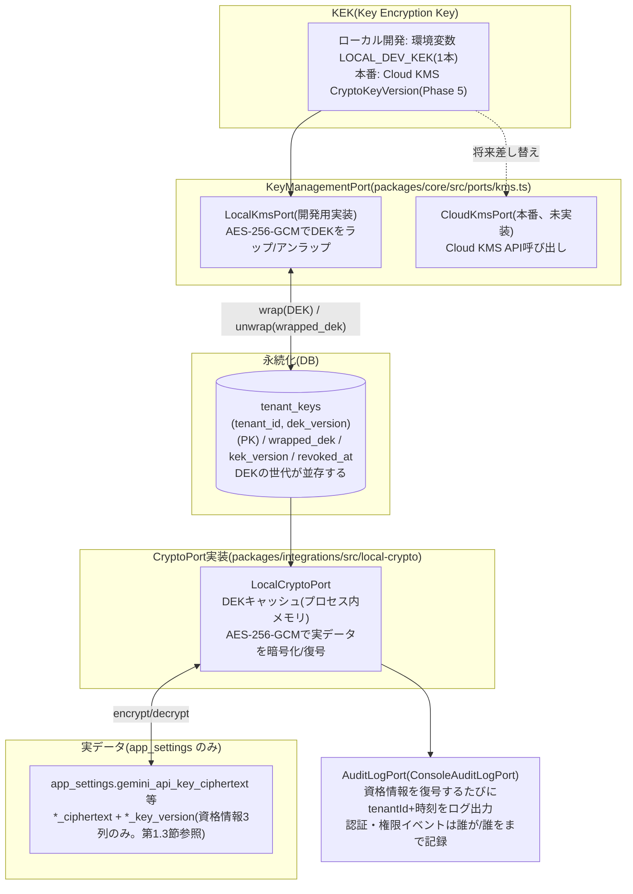
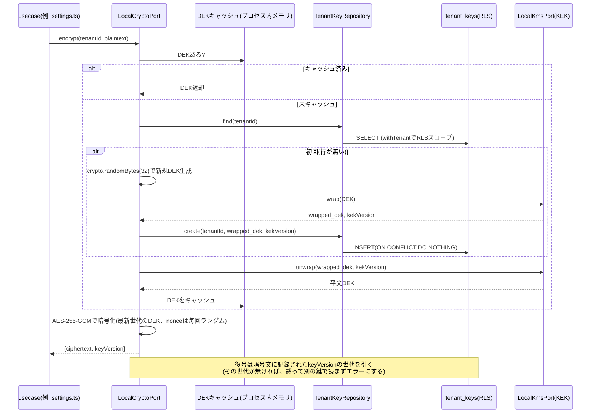

# 目的

katahimo-app(マルチテナントSaaS版)のPostgreSQLスキーマについて、有識者(セキュリティ・DB設計の観点)にレビューいただくための解説資料。実装は `packages/db/src/schema/*.ts`(Drizzle ORM)、マイグレーションは `packages/db/drizzle/*.sql` を正とする。本書はその要約・図解であり、フィールドの詳細な意味は各schemaファイルのコメントを一次情報として参照されたい。

対象読者は、実装の詳細(TypeScript/Drizzle)を読まなくても以下を判断できることを想定する。

- テナント分離の方式とその強制力(アプリのバグで他社データが漏れない設計になっているか)
- データ保護の方針(業務データは平文列+保存時暗号化+RLS、アプリ層で暗号化するのは資格情報のみ)と、資格情報用の鍵管理の妥当性
- スキーマ上の制約(PK/FK/UNIQUE)が実際にデータ整合性を守れているか

将来の拡張予定(予約・決済・カルテ・分析ダッシュボード)は `doc/proposal/tech-stack.md` 第4〜7章を参照。本書は現時点で実装済みのスキーマのみを対象とする。

---

# 1. 全体設計方針

## 1.1 マルチテナント分離: shared schema + `tenant_id` + Row Level Security(RLS)

全テーブル(`tenants`自身を除く)が `tenant_id` 列を持ち、PostgreSQLのRLSポリシー `tenant_isolation` を適用している。

```sql
USING      (tenant_id = current_setting('app.tenant_id', true)::uuid)
WITH CHECK (tenant_id = current_setting('app.tenant_id', true)::uuid)
```

アプリはリクエストごとに `withTenant(db, tenantId, fn)`(`packages/db/src/tenantScope.ts`)でトランザクションを張り、`SET LOCAL app.tenant_id` をセットしてからクエリを発行する。これにより、**アプリ側のWHERE句の書き忘れがあっても他テナントの行は見えない**(`current_setting`未設定時はNULLになり、`tenant_id = NULL` は常にfalseなので安全側に倒れる)。

## 1.2 複合主キー/複合外部キー(RLSだけでは防げない取り違えの防止)

RLSは`SELECT`/`UPDATE`/`DELETE`を絞り込むだけで、**PostgreSQLのFK制約(参照整合性チェック)はRLSを常にバイパスする**という仕様上の落とし穴がある。単一列FK(例: `daily_reports.customer_id → customers.id`)のままだと、アプリのバグでテナントAのセッション中にテナントBの`customer_id`を書き込んでも、DBはそれを検知できない。

これに対応するため、`customers`/`staff`に`UNIQUE(tenant_id, id)`を追加し、参照元テーブルのFKを`(tenant_id, xxx_id) → (tenant_id, id)`の複合FKにしている(`doc/db/reference.md` 第2章の「外部キー」参照)。これにより「そのIDが本当にそのテナントの行か」をDBの制約自体が強制する。

## 1.3 データ保護(アプリ層のフィールド暗号化は資格情報のみ)

アプリ層でフィールド暗号化するのは `app_settings` の資格情報3項目(Gemini APIキー・Google Chat Webhook URL 2本)だけとし、顧客・世帯構成員・日報・事故報告・勤怠・領収書の業務データは全て平文列で保存する。業務データの保護は、保存時の暗号化(本番配備時に Cloud SQL の既定機能で満たす想定。TDE 相当でバックアップも暗号化される。**未配備**)+ TLS + RLS(第1.1節)+ IAM/ロール分離 + argon2id で行う。

環境ごとの実態は次の3つに分かれる。ローカル開発(Docker の PostgreSQL、TDE なし)/ 公開デモ(ブラウザ内 PGlite、暗号鍵は公開されたデモ用固定値)/ 本番(Cloud Run + Cloud SQL、**未配備**)。現時点でコードとして担保しているのは RLS・ロール分離・argon2id・資格情報のアプリ層暗号化であり、Cloud SQL 側の保存時暗号化・TLS・IAM は本番配備時に満たすべき前提条件として扱う。

業務データをアプリ層で暗号化しない理由は次の3点。

- **検索性**: 日報・事故報告・勤怠・領収書を SQL で絞り込み・集計・全文検索できる。暗号文のままでは「ある顧客の日報から特定の語を探す」だけでも全件復号が要る。このため日報・事故報告の本文は JSON 1本ではなく項目ごとの `text` 列に分けた(`doc/db/reference.md` の `daily_reports`/`accident_reports` 参照)。勤怠は常に1日分をまるごと読み書きする動的なオブジェクト(訪問・事務作業を配列で持つ。キーの決め方は `doc/db/guidelines.md` §2)のため `jsonb` 1列のまま(分解する利点が無い)。
- **日報データの AI 活用**: 傾向分析・要約など日報を機械的に読む用途では、アプリ層暗号化は都度復号のコストと鍵の配線を分析側まで広げることになる。
- **契約が求める水準**: 実証協力事業者との秘密保持契約(案)第6条の安全管理措置は「アクセス制限、通信および保存時の暗号化、パスワード管理等」であり、フィールド単位の暗号化は要求していない。保存時の暗号化は本番配備時に Cloud SQL の既定機能で満たす想定(未配備)。第3条2・第4条(仙台市への報告は統計化・匿名化、スタッフ氏名は仮名化、住所は座標化)は分析・出力側の要件で、DB が平文であるほうが SQL で匿名化処理を実施しやすい。

資格情報だけ暗号化を残すのは、個人情報ではなく検索・AI 活用の対象外である一方、DB ダンプが流出した際に API キーや Webhook URL が平文で漏れるのを防ぐ価値があるため。

秘密保持契約(案)の条項との対応は次のとおり。

| NDA条項 | 要求 | katahimo-app での対応 | 状態 |
|---|---|---|---|
| 第6条 | アクセス制限 | Row Level Security(全テーブル `FORCE`。第1.1節・第1.5節)、`katahimo`(所有者/DDL)と `katahimo_app`(RLS 対象)のロール分離、管理者限定 API、セッション認証 | 実装済み(ローカル/デモで検証) |
| 第6条 | 通信時の暗号化 | HTTPS/TLS(Cloud Run。DB 接続も TLS) | 本番配備時(Cloud Run/Cloud SQL 接続設定) |
| 第6条 | 保存時の暗号化 | Cloud SQL の保存時暗号化(既定、バックアップ含む)+ 資格情報のみアプリ層 AES-256-GCM(エンベロープ暗号化。第3章) | Cloud SQL 側は本番配備時、資格情報のアプリ層暗号化は実装済み |
| 第6条 | パスワード管理 | argon2id、初期パスワードの強制変更(`must_change_password`)、ログイン試行の抑制(10回で15分ロック)、再設定コードは HMAC 検証子のみ保存 | 実装済み |
| 第7条 | 返還・廃棄 | テナント単位の物理 DELETE 手順 + バックアップ保持期間の満了(資格情報は `tenant_keys` の revoke でも復号不能にできる) | 手順・保持期間は本番配備時に定める(未整備) |
| 第3条2・第4条 | 匿名化 | 分析・AI 利用・報告書では氏名・連絡先・住所列を除外し統計化する(平文列なので SQL で実施可能。スタッフ氏名は仮名化、住所は座標化) | 分析・報告書作成時のルールとして未整備、平文列により実施可能になった |

等値検索が必要な項目は通常のインデックスで検索する(氏名の姓は `customers_tenant_family_name_idx`、領収書の重複検出は `receipts_tenant_dedupe_key_idx`)。ブラインドインデックス(HMAC)は廃止した。`receipts.dedupe_key` には `buildReceiptDedupeKey()`(`packages/core/src/domain/reports/receiptDedupe.ts`)の正規化済み文字列(スタッフ・顧客・日時・金額・店舗名)をそのまま保存し、等値一致で重複を検出する(GAS 版 `buildKey` と同じ挙動)。

資格情報の鍵はテナントごとに独立生成した DEK(データ暗号化鍵)を使い、DEK 自体は KEK(Key Encryption Key)でラップした状態のみ `tenant_keys` テーブルに保存する(エンベロープ暗号化。詳細は第3章)。

## 1.4 トランザクション境界(UnitOfWork)

リポジトリ実装はメソッドごとに `withTenant()` で自前のトランザクションを開く。単独の書き込みならそれで足りるが、「ドメインの行を書く」と「`outbox_jobs` に積む」のように**揃って成立しなければ意味がない書き込み**では、片方だけが確定してしまう。

そのため `UnitOfWorkPort`(`packages/core/src/ports/unitOfWork.ts`、実装は `DrizzleUnitOfWork`(`packages/db/src/unitOfWork.ts`))でトランザクションを1つ開き、そこで得た `TransactionScope` をリポジトリメソッドの最後の引数(省略可能な `scope?: TransactionScope`)に渡す。スコープを渡されたリポジトリは新しいトランザクションを開かず、既存のものに相乗りする(`packages/db/src/tenantScope.ts` の `withTenant`)。渡されたスコープが別のDB接続・別テナントのものであれば例外で落とし、RLSが別テナントに束縛されたトランザクションへ黙って書くことを防ぐ。

この仕組みで同一トランザクションになっているのは次の2種類。

- 日報 / 事故報告 / 勤怠(出勤簿) / 領収書の保存 + `outbox_jobs` への enqueue(片方だけ確定すると、スプレッドシートへ永久に反映されないうえ、どのレコードが取り残されたのかを知る手段が無い)
- パスワード再設定コードの消費 + 新しいパスワードの書き込み(コードだけ焼かれてパスワードが変わらない状態を作らない)

## 1.5 RLSが全テーブルに張られていることの自動検証

テナント分離は「全テーブルに漏れなく張られている」ことが前提なので、テーブル追加時の書き忘れをテストで落とす。

- `packages/db/src/rlsPolicies.test.ts`: Drizzleスキーマの export から全テーブルを動的に集め、マイグレーションSQLに `ENABLE ROW LEVEL SECURITY` と `FORCE ROW LEVEL SECURITY` の両方があること、`tenant_isolation` ポリシーの `USING` / `WITH CHECK` が揃っていることを検査する。除外は `tenants` のみ。`FORCE` はdrizzle-kitが生成しないため手で追記しており、これが無いとテーブル所有者ロールでRLSが素通りする。新しいテーブルを足して書き忘れるとCIで落ちる。
- `packages/demo/src/rlsEnforcement.test.ts`: PGlite上に非特権ロールを作り、実際にクロステナントの読み書きが止まることを検証する。`FORCE` を付けたテーブルと付けないテーブルを並べて比較し、「FORCEの有無で挙動が変わる」ところまで固定している(テストが本当にFORCEを見ていることの裏付け)。

## 1.6 DBの CHECK 制約で値域を縛る方針(`doc/db/guidelines.md` §4)

値域が決まっている列には、スキーマ定義で明示的にCHECK制約を張る。`outbox_jobs.status`/`kind`/`attempts`、`accident_reports.report_type`、`daily_reports.stress_level`/`es_rating`、`staff.failed_login_attempts`、`password_reset_codes.failed_attempts`、`tenant_keys.dek_version`/`kek_version`、`receipts.amount_yen`/`billing_type`、`customers.lat`/`lng`、`coupons`/`coupon_redemptions` の割引種別と値の組み合わせ、および第2.2〜2.5節のテーブル群がこれに当たる。入口(API)側でも、文字列かどうかではなく許可された値かどうかで判定する(DB制約は最後の砦であり、ここで弾かないとスプレッドシートへの書き出しまで進んでしまうため)。

この方針が要る理由は、Drizzleの `text({ enum: [...] })` が **TypeScript 上の型付けにすぎず、CHECK 制約としてDBには反映されない**ためである(drizzle-kitが生成するSQLに`CHECK`文は出力されない)。型で縛ったつもりでも `psql` から直接 `outbox_jobs.status='でたらめ'` を書き込めてしまい、書き込めばワーカーが永久に拾わない行になる。詳しくは `doc/db/guidelines.md` §8.1。

`outbox_jobs.kind` の許可値はDDLに固定で書き写さず、`Record<MirrorKind, true>`(`packages/db/src/schema/outbox.ts`)から組み立てている。`MirrorKind`(`packages/core/src/ports/mirror.ts`)に追加・削除があればここが型エラーになるため、DB制約とアプリのポート型がズレたまま気付けない事態を防いでいる。

`packages/demo/src/checkConstraints.test.ts` が、本番と同じマイグレーションを当てたPGlite上で各制約の「正常値は通る」「不正値は拒否される」の両方を検証する。拒否側はエラーメッセージに制約名が含まれることまで確認しており、NOT NULLやFK等の別の理由でたまたま拒否されて「検証したつもりで何も検証していない」状態になることを防いでいる。

## 1.7 `updated_at` をDBトリガーで一元管理する方針(`doc/db/guidelines.md` §5)

更新日時はアプリのコードではなく、`set_updated_at()` トリガー関数を `updated_at` 列を持つ全テーブルにBEFORE UPDATEトリガーとして張って更新する(全44テーブルのうち36テーブル。`updated_at` を持たない8テーブル — `tenants`/`receipts`/`sessions`/`password_reset_codes`/`prompt_templates`/`report_ai_generations`/`report_ai_generation_keywords`/`report_age_band_keywords` — は追記のみ・対応表・`created_at`のみで更新経路が無いため対象外)。アプリから `updatedAt` を明示指定しても、トリガーが常に `now()` で上書きする。唯一の正をDBに置くための意図した挙動である。

アプリ側でのセットを方針にしない理由は、ミラー書き込みジョブの冪等キーが `buildMirrorIdempotencyKey(kind, targetId, record.updatedAt)` のように更新時刻を材料にしているためである。UPDATE経路で `updated_at` のセットを書き忘れると冪等キーが前回と同一になり、`UNIQUE(tenant_id, idempotency_key)` に弾かれて編集内容がスプレッドシートへ永久に反映されなくなる。しかもエラーにならないため気付けない(`doc/db/guidelines.md` §5)。

トリガーはDrizzleのスキーマ定義では表現できないため、マイグレーションSQLは手書きになる。**張り忘れが新しい書き忘れの種になる**ため、`packages/db/src/rlsPolicies.test.ts`(RLSの張り忘れ検出。第1.5節)と同じ方式の静的検査 `packages/db/src/updatedAtTriggers.test.ts` を追加した。Drizzleスキーマのexportから `updated_at` 列を持つテーブルを動的に集め、マイグレーションSQLの `CREATE`/`DROP TRIGGER` を出現順に畳み込んだ最終状態を見る(対象一覧をベタ書きすると、その一覧の更新し忘れ自体がトリガーの張り忘れと同じ壊れ方をテストがしてしまう)。`packages/demo/src/updatedAtTrigger.test.ts` はPGlite上で実際にUPDATE後 `updated_at` が進むこと、`customers` の編集で進むこと(この不具合の回帰テスト)、アプリから明示指定してもトリガーに上書きされることを確認する。

## 1.8 主要な検索経路にインデックスを張る方針(`doc/db/guidelines.md` §3)

PostgreSQLは**外部キーの参照する側に索引を自動作成しない**。主キーだけに任せると、`tenant_id`/`customer_id`/`staff_id` で絞り込む主要な読み取りがすべて全件走査になる。とくに「顧客の日報履歴」を開くたびに走る `listByCustomer`(`WHERE customer_id=? ORDER BY occurred_at DESC LIMIT n`)は最も頻度の高い読み取りで、日報は毎日積み上がる追記型のデータのため放置すれば必ず遅くなる。

そのため `daily_reports`/`accident_reports`/`receipts` に `(tenant_id, customer_id, occurred_at DESC)`(`receipts` は `receipt_timestamp DESC`)、`family_members` に `(tenant_id, customer_id)`、`sessions` に `(tenant_id, staff_id)` の複合インデックスを追加した。`occurred_at`/`receipt_timestamp` をDESCで索引に含めるのは、`ORDER BY ... DESC LIMIT n` を並べ替えなしで返せるようにするため。リポジトリ層は実PostgreSQLに対する自動テストを持たないため、効果の検証は `EXPLAIN` で `Seq Scan` が `Index Scan` に変わることの手動確認にとどめている。

## 1.9 マイグレーションの運用

スキーマの土台は `packages/db/drizzle/0000_baseline_schema.sql` にまとまっている。本番環境がまだ配備されておらず(第1.3節)、引き継ぐべきデータが存在しない時点で、最終形のスキーマを1本のDDLとして持つほうがレビュー(本書もその一環)とローカル環境の再構築(`pnpm db:migrate`)を単純にできるため、それ以前の16本を1本に統合した。

**このベースラインを再び作り直すことはしない。** 以後のスキーマ変更は `pnpm db:generate` で `0001` 以降の差分マイグレーションを積み増す通常の運用に戻す。本番にデータが乗れば「引き継ぐデータが無い」という前提が使えなくなるためで、稼働中のDBを段階的かつ安全に変更するには1本ずつ積む運用が要る。

現在は `0000_baseline_schema` に加えて `0001_birthday_coupons_and_receipt_cancellation`(誕生月クーポンと領収書の取り消し)・`0002_receipt_closing_day_settings`(領収書の締め日設定)・`0003_drop_receipt_mirror_lead_days`(ミラー送信の遅延をやめたことによる列削除)・`0004_family_member_allergy`(世帯構成員のアレルギー確認状況)・`0005_daily_report_prompt_customization`(日報AIのプロンプト調整。第2.6節)が積まれている。ベースラインを作り直すと `_journal.json` の `when` が動き、既にベースラインを当てたDBでマイグレータが `CREATE TABLE` を流し直して落ちる(`drizzle-orm` の `PgDialect.migrate` は保存済みの `hash` ではなく `created_at` と `when` を比べる)。既存DBを引き継げる形を保つため、差分は必ず新しい番号で足す。

**差分マイグレーションは「既存行があっても通る」形で書く。** `NOT NULL` 列は「NULL許容で追加 → 既存行を埋める → `SET NOT NULL`」の3手に分ける(`0001` の `coupon_redemptions.customer_id` がその例)。`ADD COLUMN ... NOT NULL` をそのまま当てると、行が1件でもあるDBでは落ちる。

`0000_baseline_schema.sql` を手で書き換えてもいけない。drizzle-kit が生成しない部分(`FORCE ROW LEVEL SECURITY`、`set_updated_at()` トリガー)を手で追記した状態のファイルなので、スキーマ定義との対応はファイル先頭のコメントに書いてある手順でのみ保つ。新しいテーブルを足したときは、生成した差分マイグレーションの末尾に同じ2つを手で追記する(追記漏れは `packages/db/src/rlsPolicies.test.ts` と `updatedAtTriggers.test.ts` が検出する)。

## 1.10 区分値(CHECK制約の許可値)は `packages/shared/src/contracts/` に置く方針

第1.6節の方針(値域はDBのCHECK制約で縛る)を、全テーブルに一貫して適用する。許可値の配列そのものは `packages/shared/src/contracts/`(`transport.ts`/`customerNotes.ts`/`reservations.ts`/`billing.ts`/`optimization.ts`/`coupons.ts` など)にzodの `enum` として定義し、DB側は `packages/db/src/schema/_sqlLiteral.ts` の `sqlInList()` でその配列から `CHECK (col IN (...))` のDDLを組み立てる。

CHECK制約の右辺にDDLとして値を直接書き写さない理由は、区分値が増えたとき(例: 移動手段に新しい手段を1つ足す)にマイグレーション側の書き換えを忘れると、「アプリは新しい値を許可しているのにDBだけ古い許可値のままで、CHECK制約違反(SQLSTATE 23514)により書き込みが拒否される」というズレが起きるため。1箇所の配列を変更すれば、DDL生成・API入口のバリデーション(zod)・TypeScriptの型のすべてに反映される。

`sqlInList()` は `sql.raw()` でSQL文字列として値を埋め込む(drizzleの `sql` テンプレートに値を `${}` で渡すとバインドパラメータになり、CHECK制約はDDLの一部でパラメータを取れないため、そのままでは適用時に失敗する)。渡すのは常にコード内のzod enumの配列であり外部入力ではないが、想定外の値が紛れ込んでも黙って壊れないよう、単引用符・バックスラッシュを含む値は `sqlInList()` 内で例外を投げて弾く。

---

# 2. テーブル構成(ドメイン別)

ER図と全列の一覧は `doc/db/reference.md` にある。あちらは
`packages/db/src/schema/*.ts` から自動生成しており(`pnpm db:docs`)、スキーマを変えたのに
図が古いままになっていないことをCIで検査している。図をここに手書きで置くと本書だけが
必ず古くなるため、本章は「どう分けたか・なぜその形か」の説明に絞る。

ドメインの区切り(2.1〜2.6)は `doc/db/reference.md` の第1章・第2章と同じ順・同じ区切り。

## 2.1 既存の業務データ

GAS版から移行した範囲。テナント・スタッフ(認証を兼ねる)・顧客・世帯構成員・日報・事故報告・
領収書・勤怠・セッション・パスワード再設定・ミラー送信キュー・管理者設定・クーポン。
`customers`/`staff` は `(tenant_id, id)` にUNIQUEを持ち、参照元は複合FKで指す(第1.2節)。`family_members` は顧客IDまで含めた `(tenant_id, customer_id, id)` にUNIQUEを持ち、`daily_reports`/`report_ai_generations` からは3列の複合FKで指す(テナント内で別の家庭の子を指せないようにするため)。

## 2.2 顧客カルテ

顧客の家に関する運用情報(鍵の位置・ガレージ場所・注意点等)を1テーブル+区分で管理する。区分にした理由・写真を別テーブルにした理由は `packages/db/src/schema/customerNotes.ts` 冒頭のコメント、許可値は `packages/shared/src/contracts/customerNotes.ts` 参照。

## 2.3 予約

エンドユーザ(顧客)向け予約システム。予約(約束)と日報(実施記録)をあえて別テーブルにした理由は `packages/db/src/schema/reservations.ts` 冒頭のコメント参照。許可値は `packages/shared/src/contracts/reservations.ts` 参照。

## 2.4 請求・決済

Stripeによるカード決済等を扱う。設計上の判断(カード番号を保存しない、返金を別テーブルにしない等)は `packages/db/src/schema/billing.ts` 冒頭のコメント、許可値は `packages/shared/src/contracts/billing.ts` 参照。

## 2.5 訪問割当の最適化と移動手当

「どのスタッフをどの顧客に割り当てるべきか」の判断材料(特性・相性・移動時間)と、移動手当の算定を扱う。設計上の判断は `packages/db/src/schema/optimization.ts`/`transport.ts` 冒頭のコメント、許可値は `packages/shared/src/contracts/optimization.ts`/`transport.ts` 参照。

## 2.6 日報AIのプロンプト調整

GAS版が「ＡＩプロンプト」シートで持っていたプロンプト文面の置き場所(`prompt_templates`。版を積み、有効版は最大 `version`)と、保護者向け文面を「子の年齢帯 × 家庭の教育関心度 × 保護者のストレス度」の3軸で組み替えるための表(`report_age_bands`/`report_keywords`/`report_education_levels`/`report_stress_levels`/`report_phrases`/`customer_report_profiles`)、AI生成1回ごとの記録(`report_ai_generations`/`report_ai_generation_keywords`)。`daily_reports` は `ai_generation_id`(保存した本文の元になった生成)と `target_family_member_id`(主に描いている子)でこの領域を参照する。日報から参照されない生成記録(保存されなかった下書き)は、既定365日(環境変数 `AI_GENERATION_RETENTION_DAYS`)を過ぎたら `packages/worker` が日次で削除する。日報から参照されている記録は保持期間を過ぎても消さない。3軸の意味と設計判断は `doc/db/new-domains.md` 第6章、許可値・値域は `packages/shared/src/contracts/reportAi.ts`、組み立てロジックは `packages/core/src/domain/reports/promptAssembly.ts` 参照。

### 関係の読み方の補足

- 複合FK(`(tenant_id, xxx_id) → (tenant_id, id)`)は、mermaidのerDiagram記法では関係線を1本しか
  引けないため `doc/db/reference.md` の図では単線になる。実際に張られている列の組は `doc/db/reference.md` 第2章の
  「外部キー」、実体は `packages/db/drizzle/*.sql` のDDLを参照。
- `doc/db/reference.md` の図では、外部キーがNULL可な関係を「親を持たない子があり得る」形(`|o`)で描いている。
  `receipts`と`customers`がその代表で、`customer_id`をnullableにしているのは経費のみの領収書
  (駐車場代等)を許容するため。

---

# 3. 暗号化アーキテクチャ(エンベロープ暗号化)

本章の仕組みが適用されるのは `app_settings` の資格情報3列だけ(第1.3節)。業務データは平文列なので、この章の鍵階層・監査・revoke はいずれも業務データには及ばない。

## 3.1 鍵の階層と依存関係



## 3.2 初回暗号化〜復号までの流れ(シーケンス)



## 3.3 設計上のポイント

- DEKはテナントごとに`crypto.randomBytes(32)`で独立に生成し、平文のままでは保存せず、常にKEKでラップした状態のみ`tenant_keys`に保存する。KEKが漏洩しても、攻撃者はテナントごとの`wrapped_dek`(DBの実体)も別途手に入れない限り実値を復号できない。
- **DEKは世代を並存させる**。主キーが`(tenant_id, dek_version)`の複合になっているため、`rotate()`は新しい世代を1行足すだけで済む。暗号化は常に最新世代、復号は暗号文に記録された世代(`*_key_version`)の鍵で行うので、ローテーションしても既存データが読めなくなることはない。1テナント1行だと、ローテーションした瞬間に旧世代の暗号文がすべて読めなくなる(=ローテーションが実質不可能になる)。
- テナント解約時に`tenant_keys`の該当行を`revoke()`すると、バックアップに残った暗号文も含めて復号不能になる(暗号学的削除。世代が複数あっても、revoke後はどの世代も復号できない)。**ただし効くのは資格情報3列だけ**。顧客等の業務データは平文なので、解約・返還・廃棄(NDA 第7条)はテナント単位の物理 DELETE とバックアップ保持期間の満了で担保する(第1.3節の対応表)。
- 本番のCloud KMSへの移行は、`KeyManagementPort`の実装(`LocalKmsPort`→Cloud KMS呼び出し)を差し替えるだけで済む設計にしてある(呼び出し側・DBのデータ形式は変えずに済む)。

## 3.4 現時点で未対応の項目(レビューで論点にしていただきたい点)

- **本番のKEK(Cloud KMS)は未実装**。KEKは環境変数(`LOCAL_DEV_KEK`)のままで、`CloudKmsPort`は差し替え口を用意してあるだけ。
- **既存データの再暗号化バッチは未実装**。DEKのローテーション自体は世代を足す形で行えるが(第3.3節)、古い世代で暗号化された値は古い世代の鍵のまま残る。読めなくはならない代わりに、**古い世代の鍵を捨てられない**。KEKのみのローテーション(rewrap)は`TenantKeyRepositoryPort.updateWrappedDek`で軽量に行える。
- **復号の監査ログ**は「どのテナントのデータをいつ復号したか」までで、「どのスタッフが」までは記録していない(`CryptoPort.decrypt(tenantId, value)`のシグネチャに呼び出し元情報が無いため。復号の呼び出し箇所は資格情報を読む経路(管理者設定の読み出し・Gemini 呼び出し・Chat 通知)だけに減ったので、配線の影響範囲は以前より小さい)。認証・権限まわりのイベント(`AuditLogPort.record`)は呼び出し箇所が限られるため、`actorStaffId`(誰が)・`targetStaffId`(誰を)まで記録している。
- **業務データへの参照は監査の網に入らない**。顧客・世帯構成員・日報・事故報告・勤怠・領収書は全て平文列なので(第1.3節)、その参照は復号を経由せず`recordDecrypt`が呼ばれない。`recordDecrypt`が捕捉するのは資格情報の復号だけになった。データアクセス監査が必要になった場合は、DB側の監査(pgaudit等)が本命。

---

# 4. テーブル一覧と役割

| テーブル | 役割 | RLS | 備考 |
|---|---|---|---|
| `tenants` | テナント(法人)マスタ | 対象外(ログイン前のテナント特定に必要) | `slug`でテナントを特定後、RLSスコープ内で`staff`を検索する2段階方式 |
| `tenant_keys` | テナントごとのDEK(ラップ済み) | ○ | 主キーは`(tenant_id, dek_version)`。世代ごとに1行(第3章参照) |
| `staff` | スタッフ(認証情報を兼ねる) | ○ | `(tenant_id, id)`にUNIQUE。ログイン試行の絞り込み(`failed_login_attempts`/`locked_until`)もここ。訪問割当の最適化用に`home_address`/`home_lat`/`home_lng`/`preferred_transport_mode`を持つ(第2.5節) |
| `customers` | 顧客(利用世帯の代表者) | ○ | RESERVA CSVの全列に対応、39列。`(tenant_id, id)`にUNIQUE。緯度経度は`lat`/`lng`の数値2列(`doc/db/guidelines.md` §7)。生年月日は`dob_date`+`dob_raw`(`doc/db/guidelines.md` §6。CSVに列が無いため手入力で入り、再取込では上書きしない) |
| `family_members` | 世帯構成員(子ども等) | ○ | `customers`の1:N。氏名・付帯情報は平文。生年月日は`dob_date`(日付型)+`dob_raw`(元表記)の2列(`doc/db/guidelines.md` §6)。アレルギーは自由記述と分けて`allergy_status`(未確認/なし/あり)+`allergy_note`の2列で持ち、取込での全件入れ替え時は氏名で突き合わせて引き継ぐ(`doc/db/guidelines.md` §11)。`(tenant_id, customer_id, id)`にUNIQUE(`daily_reports`・`report_ai_generations`の`target_family_member_id`からの複合FKの参照先。顧客IDまで含めるのは、別の家庭の子を指せないようにするため) |
| `daily_reports` | 保育日報 | ○ | `staff`・`customers`双方への複合FK。本文は項目ごとの平文`text`列。開始・終了は`started_at`/`ended_at`(timestamptz)(`doc/db/guidelines.md` §6)。`reservation_id`で対応する予約に紐付け(任意。第2.3節)。`stress_level`は保護者のストレス度(PSI評価。1〜5)でAI生成の文面調整に使う。`target_family_member_id`(主に描いている子)・`ai_generation_id`(本文の元になったAI生成)はどちらも任意(第2.6節) |
| `accident_reports` | 事故報告/ヒヤリハット | ○ | 同上。本文は項目ごとの平文`text`列。対象児の生年月日は`target_dob_date`+`target_dob_raw`の2列(`doc/db/guidelines.md` §6) |
| `receipts` | 領収書登録(実費報告) | ○ | `customer_id`はnullable(経費のみの領収書を許容)。重複検出は平文`dedupe_key`の等値一致(取り消した行は対象外)。金額は`amount_yen`(整数)+`amount_raw`(生文字列)の2列、`billing_type`で顧客請求/会社経費を区別(`doc/db/guidelines.md` §1・§10)。訂正は編集ではなく`cancelled_at`を立てる論理削除で、行は消さない(`doc/db/guidelines.md` §10)。`(tenant_id, id)`にUNIQUE(`invoice_lines`からの複合FKの参照先。第2.4節) |
| `attendance_days` | 勤怠(出勤簿)1日分 | ○ | 入力値は`row_data jsonb`(平文)。キーは`visits`/`officeWork`等の意味のあるキー(`doc/db/guidelines.md` §2)。派生値(残業時間等)は保存せず都度計算 |
| `sessions` | ログインセッション | ○ | 生トークンはCookieのみ、DBにはSHA-256ハッシュだけ保存 |
| `password_reset_codes` | パスワード再設定の6桁コード | ○ | DBに保存するのはペッパー(環境変数、DBには置かない)を鍵にしたHMAC-SHA256の検証子。有効期限30分・誤入力5回で無効 |
| `outbox_jobs` | スプレッドシート等へのミラー書き込みジョブキュー | ○ | `(tenant_id, idempotency_key)`にUNIQUE。失敗は指数バックオフで再試行(`next_attempt_at`)し、上限8回に達した分だけ`failed`(デッドレター) |
| `app_settings` | テナント単位の管理者設定(APIキー等) | ○ | 1テナント1行、`tenant_id`がPK。資格情報3列がリポジトリ内で唯一のアプリ層暗号化列(第3章)。領収書の締め日(`receipt_closing_day`/`receipt_cancellable_days`)もここに置く。取り消し期限がこの2列から導かれる(`doc/db/guidelines.md` §10) |
| `coupons` | 割引クーポンの種別マスタ(金額引き/率引き) | ○ | `(tenant_id, code)`・`(tenant_id, id)`にUNIQUE。適用条件は`audience`/`eligibility_kind`/`usage_limit_kind`の3列で表す。廃止は`active=false`(行は消さない。`doc/db/guidelines.md` §9) |
| `customer_coupons` | 顧客へのクーポン配布(`audience='assigned'`のクーポンが使えるようになる) | ○ | `customers`・`coupons`双方への複合FK。`(tenant_id, customer_id, coupon_id)`にUNIQUE。顧客ごとの有効期間はマスタの期間に重ねて効く(`doc/db/guidelines.md` §9) |
| `coupon_redemptions` | 日報1件への割引クーポン適用記録 | ○ | `(tenant_id, daily_report_id, customer_id)`で`daily_reports`への複合FK(日報の顧客と食い違う行を作れない)。`(tenant_id, daily_report_id, coupon_id)`にUNIQUE(二重適用防止)。使用上限は`(tenant_id, coupon_id, customer_id, usage_scope_key)`の部分UNIQUEで守る。適用時点の割引条件をスナップショットして保持(`doc/db/guidelines.md` §9)。`(tenant_id, id)`にUNIQUE(`invoice_lines`からの複合FKの参照先。第2.4節) |
| `customer_notes` | 顧客カルテの記載事項(カルテ/申し送り/鍵の位置/ガレージ場所/引き継ぎ事項/注意点) | ○ | `category`はCHECK制約。`pinned`で一覧上部に固定表示、`resolved_at`/`resolved_by_staff_id`は必ず対で入る(CHECK)。第2.2節 |
| `customer_note_photos` | カルテ記載に添付する写真 | ○ | 実体はStoragePort(GCS想定)、DBは`file_key`のみ保持(UNIQUE)。`sort_order`に一意制約は付けない(人が2枚を入れ替えるUPDATEが一意制約の即時検査で必ず衝突するため。並び順の決定性は`ORDER BY sort_order, id`で担保)。第2.2節 |
| `service_menus` | 予約時に選ぶサービスメニュー(所要時間・基本料金) | ○ | `(tenant_id, code)`にUNIQUE。取込元と取込元IDは対で必須。値上げは行を書き換えず、過去の請求は`invoice_lines`側にスナップショット。第2.3節 |
| `reservations` | 予約(エンドユーザ向け予約システムの中心) | ○ | `status`/`source`はCHECK制約。状態とタイムスタンプの整合もCHECKで担保。取込元と取込元IDは対で必須(片方だけだと一意索引のNULL比較で重複を通してしまう)。`daily_reports.reservation_id`と1件まで対応。第2.3節 |
| `reservation_assignments` | 予約へのスタッフ割当(主担当/同行) | ○ | `(tenant_id, reservation_id, staff_id)`にUNIQUE。主担当(`role='primary'`)は1予約1人まで(部分UNIQUE)。第2.3節 |
| `staff_availabilities` | スタッフの受付枠(繰り返し/特定日、受付可・不可) | ○ | `weekday`と`specific_date`はどちらか一方のみ(CHECK)。第2.3節 |
| `customer_payment_profiles` | 顧客のStripe上の識別子(カード番号は保存しない) | ○ | `(tenant_id, customer_id)`にUNIQUE(1顧客1プロフィール)。第2.4節 |
| `invoices` | 請求書(1顧客・1請求期間につき1枚) | ○ | 金額は全て円の整数。`total_yen = subtotal_yen - discount_yen + tax_yen`をCHECKで強制。第2.4節 |
| `invoice_lines` | 請求明細(日報・領収書・クーポン適用のどれが根拠かを持つ) | ○ | `receipt_id`/`coupon_redemption_id`は部分UNIQUEで二重請求を防止(`superseded_at IS NULL` の行だけを対象にするので、請求書をvoidして作り直せる)。第2.4節 |
| `payments` | 入金(決済)1件(Stripe PaymentIntentまたは現地決済) | ○ | `refunded_amount_yen <= amount_yen`をCHECKで担保。第2.4節 |
| `stripe_webhook_events` | Stripe Webhookの受信記録(冪等化の台帳) | ○ | `(tenant_id, stripe_event_id)`にUNIQUE。第2.4節 |
| `trait_definitions` | 顧客/スタッフの特性項目マスタ(訪問割当の最適化用) | ○ | `subject_kind`/`value_type`はCHECK制約。相性計算の重み`match_weight`を持つ。第2.5節 |
| `customer_traits` | 顧客側の特性の値 | ○ | `value_bool`/`value_int`/`value_text`はちょうど1つだけ非null(CHECK)。固定値の区別子`definition_subject_kind`を複合FKに含め、スタッフ側の項目を参照できないようにしている。第2.5節 |
| `staff_traits` | スタッフ側の特性の値 | ○ | 同上。第2.5節 |
| `staff_customer_compatibilities` | スタッフと顧客の相性(スコア/絶対に組ませないフラグ) | ○ | `avoid=true`なら`reason`が空文字禁止(CHECK)。第2.5節 |
| `staff_customer_travel_estimates` | スタッフ自宅↔顧客宅の所要時間・距離(移動手段ごと) | ○ | `(tenant_id, staff_id, customer_id, transport_mode)`にUNIQUE。第2.5節 |
| `transport_allowance_rules` | 移動手当の単価マスタ(移動手段ごとの計算方法・単価) | ○ | `calc_kind`と`unit_amount_yen`の組み合わせをCHECKで縛る。第2.5節 |
| `travel_legs` | 移動区間1件(誰が・いつ・どこから・何で移動し、手当額はいくらか) | ○ | `allowance_yen`と`allowance_rule_id`は必ず対で入る(CHECK)。第2.5節 |
| `prompt_templates` | プロンプト文面(キーごとの版) | ○ | `(tenant_id, key, version)`にUNIQUE。追記のみで有効版は最大`version`。`key`はCHECK制約。テナントの版が無いキーはコードの既定文面へフォールバック。第2.6節 |
| `report_education_levels` | 家庭の教育関心度★(1〜5)ごとの、教育キーワードの使い方 | ○ | `(tenant_id, level)`にUNIQUE。`max_keywords`(0〜3)・`allow_term_names`をコードが読んで指示文を組み立てる。第2.6節 |
| `report_stress_levels` | 保護者のストレス度(1〜5)ごとの判定基準と文面への効き方 | ○ | `(tenant_id, level)`にUNIQUE。`education_level_shift`(0〜-4)・`keywords_enabled`・`escalation_required`の3列で★より優先する安全弁を表す。第2.6節 |
| `report_age_bands` | 子の年齢帯(月齢の範囲と、その時期の行動語) | ○ | `(tenant_id, code)`・`(tenant_id, id)`にUNIQUE。月齢は半開区間`[age_from_months, age_to_months)`(CHECK)。帯どうしの重なり禁止は入口で担保。第2.6節 |
| `report_keywords` | 教育キーワードと、使ってよい条件(月齢・★の範囲・ストレス度の下限) | ○ | `(tenant_id, code)`・`(tenant_id, id)`にUNIQUE。廃止は`active=false`(生成記録が参照するため行は消さない)。第2.6節 |
| `report_age_band_keywords` | 年齢帯と相性の良いキーワードの対応 | ○ | 主キー`(tenant_id, age_band_id, keyword_id)`。双方への複合FK。第2.6節 |
| `report_phrases` | 温かみ表現(`encourage`)と全日報で避ける表現(`avoid`) | ○ | `kind`/`placement`はCHECK制約。適用するストレス度の範囲を持つ(`avoid`は常に1〜5)。第2.6節 |
| `customer_report_profiles` | 家庭ごとの日報の書き方の設定(教育関心度★) | ○ | 主キー`(tenant_id, customer_id)`。`customers`の列にしないのはCSV取込の上書きで消えないようにするため。第2.6節 |
| `report_ai_generations` | AI生成1回の記録(モデル・使った版・送ったプロンプト全文・★/ストレス度・入力・生の出力) | ○ | 使った版は`prompt_template_id`(既定文面ならNULL)、実際に送った全文は`prompt_text`(既定文面はコードのリリースで変わるため、版IDだけでは復元できない)。`(tenant_id, id)`と`(tenant_id, customer_id, id)`にUNIQUE(後者は`daily_reports.ai_generation_id`からの複合FKの参照先)。`output_json`と`error_message`はちょうど一方だけ非NULL(CHECK)。`updated_at`を持たない事実の記録。日報から参照されない行(下書き)は既定365日でワーカーが削除、参照されている行は残す。第2.6節 |
| `report_ai_generation_keywords` | 生成1回で提示した候補(`candidate`)とAIが使った語(`used`) | ○ | 主キー`(tenant_id, generation_id, keyword_id, role)`。`role`はCHECK制約。第2.6節 |

## 4.1 `customers` の列の設計意図

全39列の一覧(型・NULL可否・既定値・制約)は `doc/db/reference.md` の `customers` の節にある。
ここでは列の持ち方を決めた理由だけを挙げる。暗号化列は無い(第1.3節)。

- **氏名**: `family_name`は`(tenant_id, family_name)`のインデックスで苗字検索に使うため、
  `name`とは別に分けて持つ。
- **連絡先・住所**: RLSで保護。保存時暗号化は本番のCloud SQL配備時に満たす前提条件で、現時点では未配備(ローカル開発のPostgreSQLと公開デモのPGliteには掛かっていない。第1.3節)。分析・報告時は除外/座標化の対象(NDA 第3条2・第4条)。
- **第三者情報・自由記述**(緊急連絡先・避難場所・メモ): 検索性・AI活用のため平文(第1.3節)。
- **位置情報**: 計算(距離・ジオフェンス・座標化しての仙台市報告)に使うため、`numeric(9,6)`の
  数値2列(`lat`/`lng`)+元表記(`lat_lng_raw`)に分けて持つ(`doc/db/guidelines.md` §7)。`lat`/`lng`には
  CHECKで実在する座標の範囲(緯度-90〜90、経度-180〜180)を課す。
- **分類情報**(会員区分・支払方法・性別・年代等): 個人特定に直結しない運用区分。
- **生年月日**: 誕生月クーポン(`doc/db/guidelines.md` §9)の判定に使う。RESERVA CSVに列が無いため取り込みでは
  埋まらず、顧客カルテからの手入力で入る(再取り込みでは上書きしない)。日付型(`dob_date`)と
  元表記(`dob_raw`)の2列に分けるのは`doc/db/guidelines.md` §6。

---

# 5. レビュー観点(確認いただきたい点)

1. 複合PK/FK(第1.2節)によるテナント跨ぎ防止は、RLSと組み合わせた「二重の防御」として妥当か。他に見落としているPostgreSQLの仕様上の落とし穴はないか。
2. エンベロープ暗号化(第3章)の鍵階層(KEK→DEK→実データ)は、本番のCloud KMS移行を見据えた設計として妥当か。DEKの世代を並存させる方式(新しい書き込みだけ最新世代)を採っているが、既存データを新世代へ移す再暗号化の推奨手順(オンライン再暗号化 vs メンテナンス時間を確保したバッチ)に定石はあるか。
3. 復号の監査ログ(第3.4節)について、「誰が」まで記録する必要性・優先度をどう評価すべきか(認証・権限まわりのイベントは「誰が・誰を」まで記録している一方、平文列への参照は監査の網に入らない。医療系記録(将来の訪問看護展開、`doc/proposal/tech-stack.md`第7章)を扱う場合のコンプライアンス要件との関係)。
4. フィールド暗号化の対象は資格情報3列のみとし、業務データは平文+保存時暗号化+RLS としている(第1.3節)。論点: 秘密保持契約(案)第3条2・第4条の匿名化ルール(氏名・連絡先・住所列の除外、スタッフ氏名の仮名化、住所の座標化)を分析・AI 利用時に SQL/ビューで実施する運用は妥当か。第7条(返還・廃棄)をテナント単位の物理 DELETE + バックアップ保持期間の満了で担保する整理に不足はないか。
5. 日報・事故報告の本文は項目ごとの平文`text`列に分け、勤怠は`jsonb`1列としている(第1.3節・第2章)。論点: 業務データが平文であるため復号監査(第3.4節)が資格情報にしか効かなくなったため、DB 側監査(pgaudit 等)を入れるべき時期・粒度と、全文検索インデックス(`tsvector`/`pg_bigm` 等)を日報本文に付与する際の注意点。
6. 本番配備時のチェックリスト(TLS・保存時暗号化・バックアップ保持・削除手順)の妥当性(第1.3節。本番環境は未配備のため、配備前にこのチェックリストで確認する)。
